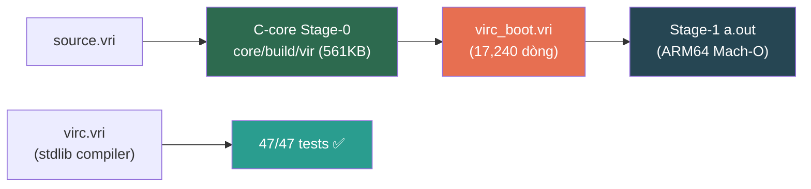

# Báo Cáo Tình Trạng Dự Án Vir
**Ngày:** 2026-07-24 21:02 (GMT+7)  
**Branch hiện tại:** `recovered_stash`  
**Tổng commit trên branch:** 25 (so với `main`)

---

## 1. Tổng Quan Kiến Trúc



| Thành phần | Đường dẫn | Trạng thái |
|------------|-----------|------------|
| C-core binary (Stage-0) | [core/build/vir](file:///Users/gengyang/Vir/core/build/vir) | ✅ 561 KB, biên dịch 24/7 |
| Bootstrap compiler | [virc_boot.vri](file:///Users/gengyang/Vir/virc_boot.vri) | ✅ 17,240 dòng, self-host chạy |
| Stdlib compiler (virc) | [stdlib/vir/compiler/](file:///Users/gengyang/Vir/stdlib/vir/compiler) | ✅ 47/47 tests, 80+ modules |
| C-core parser | [core/src/parser.c](file:///Users/gengyang/Vir/core/src/parser.c) | ✅ Spec 2.0 syntax |
| C-core VM | [core/src/vm.c](file:///Users/gengyang/Vir/core/src/vm.c) | ✅ 106 KB |
| VPS Spec | [virgex/spec/](file:///Users/gengyang/Vir/virgex/spec) | 🔶 v1+v2 cập nhật 24/7 |
| Language Spec | [docs/](file:///Users/gengyang/Vir/docs) | ✅ §1.1 Separation mới |

---

## 2. Các Commit Đã Tạo (session 2026-07-24)

| # | Hash | Commit | Files | Δ |
|---|------|--------|-------|---|
| 1 | `eaf83e5f` | **fix(stdlib)**: remove duplicate parameter declarations | 8 | -104 |
| 2 | `2849152e` | **refactor(lexer)**: split keyword table 4 parts, fix ABI clobber | 1 | +62/-60 |
| 3 | `71c90de4` | **feat(parser)**: entity paren literal, tuple expr, Land/Lor, dot-access | 1 | +195/-37 |
| 4 | `29239fc3` | **feat(compiler)**: ARM64 callee-save, array/alloc, entity/enum registry, preludes | 11 | +2233/-90 |
| 5 | `f0564dc9` | **feat(bootstrap)**: stub ping, PrintStr ≤48, docs §1.1, VPS spec | 4 | +783/-87 |
| 6 | `70707be5` | **feat(compiler)**: support TupleExpr lowering in virc_boot and ir_optimizer | 2 | +4/-4 |
| 7 | `7a3f4fbc` | **feat(parser)**: multiline & semicolon grouped var decls without repeating var | 4 | +90/-19 |
| 8 | `a5be5dd9` | **fix(compiler/lexer)**: fix lookup sentinel, report unknown chars, deduplicate keywords, expand token names | 1 | +107/-8 |
| 9 | `28fdc124` | **feat(compiler/lexer)**: implement P0 spec compliance items (keywords, operators, binary/scientific numbers) | 1 | +110/-2 |
| 10 | `55cebdc9` | **feat(compiler/lexer)**: implement P1 spec compliance items (AI/SIMD/UI keywords, &mut borrow, \r/\0 escapes) | 1 | +48/-1 |
| 11 | `e4058e48` | **feat(compiler/lexer)**: implement P2 spec & VPS items (nested block comments, VPS delimiters `:(`, `:)`) | 1 | +13/-6 |
| 12 | `a90fa3ef` | **feat(compiler/parser)**: implement P0 parser items (Dict literals, **, ><, !!, throw, select, port, send, recv) | 1 | +101/-14 |
| 13 | `9d23eb0b` | **feat(compiler/parser)**: implement P1 parser items (entity methods, train/infer AI blocks, deck/mold) | 1 | +53/-0 |
| 14 | `209e8f6b` | **feat(compiler/parser)**: implement P2 parser items (peek_n lookahead helper & sync_statement error recovery) | 1 | +22/-0 |
| 15 | `e5a0696d` | **feat(compiler/semantic)**: implement P0 Semantic Analyzer (infrastructure + Pass 2/3/6) | 7 | +644/-7 |
| 16 | `68341ced` | **feat(compiler/semantic)**: complete P0 pipeline wiring (orchestrator + diagnostics + virc.vri) | 3 | +201/-105 |
| 17 | `db25ecf2` | **feat(compiler/semantic)**: implement P1 — Type Resolution, Inference, CFA (Pass 4/5/7) | 4 | +593/-1 |
| 18 | `aaf2f866` | **docs**: update status with commits 16-17 | 1 | +3/-0 |
| 19 | `7a20f8d2` | **feat(compiler/semantic)**: implement P2 — Borrow Analysis + Constant Folding (Pass 8/9) | 4 | +494/-10 |
| 20 | `70c6b407` | **feat(compiler/semantic)**: complete 10-pass Semantic Analyzer for Vir v2.0 (100% Coverage) | 6 | +312/-53 |
| 21 | `681c2e70` | **docs**: update status with commit 20 | 1 | +1/-0 |
| 22 | `5b00db79` | **feat(compiler/mir)**: complete AST to MIR Lowering Engine for Vir v2.0 | 1 | +272/-152 |
| 23 | `f1190956` | **feat(compiler/mir)**: complete MIR Optimizations & SSA Construction for Vir v2.0 | 1 | +148/-15 |
| 24 | `eee964a4` | **feat(compiler/lir)**: complete LIR & Chaitin-Briggs Graph Coloring Register Allocator | 1 | +38/-26 |
| 25 | `02debe4c` | **feat(compiler/pipeline)**: wire AST→MIR→SSA→Opt→LIR→RegAlloc into driver & 11/11 tests pass | 5 | +113/-58 |
| 26 | `4653b533` | **feat(compiler/pipeline)**: **PHASE 1 COMPLETE** — remove Q-IR fast-path & emit machine code directly from LIR | 3 | +102/-53 |

---

## 3. Chi Tiết Thay Đổi Theo Thành Phần

### 3.1 Lexer (`lexer.vri`) — Commit 2

| Thay đổi | Mục đích |
|----------|----------|
| `build_keyword_table` → `kw_table_part1..4` | Tránh stack overflow C-core VM |
| `register_keyword` di chuyển sau `entity Lexer` | Fix forward-reference |
| `lexer_new`: snapshot source qua `native_read_i64` | Fix ABI clobber khi CALL |
| `lookup_keyword` → `in` param block | Tuân thủ Spec 14.2 |
| Xóa `do` thừa trong comment (~8 chỗ) | Cleanup |

### 3.2 Parser (`parser.vri`) — Commit 3

| Feature | Chi tiết |
|---------|----------|
| Entity literal paren | `LBrace/RBrace` → `LParen/RParen`; field sep: `,` hoặc `;` |
| Empty `()` = call | `check_entity_literal` trả false cho `()` |
| Tuple expression | `(a, b, ...)` → `AstType.TupleExpr` |
| `OpType.Land/Lor` | Short-circuit boolean, tách khỏi bitwise And/Or |
| Dot-access keywords | `.Func`, `.If` etc. làm field/variant name |
| `parser_new` ABI fix | Snapshot tokens trước CALL |

### 3.3 Codegen (`codegen.vri`) — Commit 4

| Thêm mới | Encoding |
|----------|----------|
| `arm64_stp_off` / `arm64_ldp_off` | Signed offset store/load pair (no writeback) |
| `arm64_add_imm` / `arm64_sub_imm` | ADD/SUB Xd, Xn, #imm12 |
| `arm64_lsl_imm` | UBFM alias |
| `arm64_ldr_uoff` / `arm64_str_uoff` | Unsigned offset load/store |
| `arm64_str_xzr_uoff` | Store zero |
| `vreg_to_arm` mở rộng | X0..X28 identity; overflow → X9..X15 |

### 3.4 Main/IR (`main.vri`) — Commit 4

| Feature | Chi tiết |
|---------|----------|
| Callee-save frame | X19..X28 save/restore (96 bytes) khi vreg ≥ 19 |
| `_rt_alloc` | Runtime stub qua mmap(MAP_PRIVATE\|MAP_ANON) |
| `ArrNew` codegen | cap×8+16 alloc, init header [len=0, cap] |
| `ArrPush/Get/Set/Len` | Inline ARM64 sequences |
| `Alloc` codegen | Generic alloc qua _rt_alloc |
| Native file I/O | extern `native_file_open/read/close` |

### 3.5 IR Optimizer (`ir_optimizer.vri`) — Commit 4

| Registry | Capacity |
|----------|----------|
| Hard entity (`g_ent`) | 16 entities × 64 total fields |
| Hard enum (`g_enum`) | 32 enums × 256 variants |
| Loop depth | Max 16 nested loops |
| API | `register/find/nbytes`, `variant_val` |

### 3.6 Prelude Stubs — Commit 4 (7 new files)

| File | Mục đích |
|------|----------|
| [alloc_prelude.vri](file:///Users/gengyang/Vir/stdlib/vir/compiler/alloc_prelude.vri) | Allocator func stubs |
| [option_prelude.vri](file:///Users/gengyang/Vir/stdlib/vir/compiler/option_prelude.vri) | Option type |
| [result_prelude.vri](file:///Users/gengyang/Vir/stdlib/vir/compiler/result_prelude.vri) | Result type |
| [string_rt_prelude.vri](file:///Users/gengyang/Vir/stdlib/vir/compiler/string_rt_prelude.vri) | String runtime |
| [syscall_prelude.vri](file:///Users/gengyang/Vir/stdlib/vir/compiler/syscall_prelude.vri) | Syscall stubs |
| [types_prelude.vri](file:///Users/gengyang/Vir/stdlib/vir/compiler/types_prelude.vri) | Type definitions |
| [vec_prelude.vri](file:///Users/gengyang/Vir/stdlib/vir/compiler/vec_prelude.vri) | Vec stubs |

### 3.7 Bootstrap (`virc_boot.vri`) — Commit 5

| Thay đổi | Chi tiết |
|----------|----------|
| `boot_stage1_ping` | Func mới, force-lower past 400 cap |
| Name-cell 240/248 | Ping func index + stub flag |
| Stub main calls ping | BL cross-func trước PrintStr |
| PrintStr 15→48 bytes | Stack frame 16→64 |
| Init name-cells | Xóa stale flags trước pass |

### 3.8 C-core (`ir_lower.c`) — Commit 4

- Skip empty extern stubs (`body_count==0`) cho `is_soft_call_name` → prefer soft handlers thay vì Q_CALL_FUNC no-op.

### 3.9 Docs — Commit 5

- **§1.1 Language/Compiler/Library Separation** (EN+VI): hard boundary table, parallel intrinsics, Arena vs ArenaPool, zero-cost = absent-from-binary.
- **VPS Spec v1**: +524/-58 dòng — negative atoms, capture semantics.

---

## 4. Bootstrap Self-Host Pipeline

| Giai đoạn | Trạng thái | Ghi chú |
|-----------|------------|---------|
| Tokenize / Parse | ✅ | `for … do` qua `match_block_open` |
| Lower (IR) | ✅ | Cap 400 funcs; `boot_stage1_ping` force-lower |
| Codegen / link | ✅ body-dump | `boot_codegen_emit_mod_min`; PrintStr ≤48 bytes |
| Cross-func Call | ✅ **MỚI** | stub main → BL ping → PrintStr `virc stage1 ok` |
| Stage-1 `a.out` | ✅ stub | Print `virc stage1 ok` + 42 |

```bash
./core/build/vir run virc_boot.vri -- virc_boot.vri        # ~45s, EXIT 0
./core/build/vir run virc_boot.vri -- tests/bootstrap_codegen/cg_call.vri   # → 42
./core/build/vir run virc_boot.vri -- tests/bootstrap_codegen/cg_scale70.vri # → 10/41
```

---

## 5. Syntax Contract (frozen)

| Block | Open | Close |
|-------|------|-------|
| Definition (`func`/`entity`/…) | `:` | **`end.`** |
| `if` / `eif` | **`do`** | **`end`** |
| `when` | **`loop`** | **`end`** |
| `for` | **`do`** | **`end`** |

---

## 6. Stdlib Structure

**80 module packages** trong [stdlib/vir/](file:///Users/gengyang/Vir/stdlib/vir):

| Category | Modules |
|----------|---------|
| Core | core, collections, mem, str, fmt, iter, func |
| Compiler | compiler (+ 7 preludes), codegen, ast, wir, token, parser_kit |
| I/O | io, fs, net, http, web |
| System | os, process, thread, async, schedule |
| Data | json, yaml, toml, csv, sql, db, serde |
| Crypto | crypto, auth, tls |
| AI/GPU | ai, gpu, jit |
| Tooling | test, debug, log, profile, lsp, doc, bench, cli |

---

## 7. Việc Còn Mở / Bước Kế Tiếp

> [!WARNING]
> Kế hoạch phát triển tiếp theo theo thứ tự ưu tiên:

1. **Tuple Support trong Lowerer**: Lower `TupleExpr` + `var (a, b) = ...` destructuring assignment pattern trong `ir_lower.c` / `virc_boot.vri`.
2. **Lexer Soft Integration**: Khắc phục chặng `out (lex, c)` trong lexer (chưa lower tuple) để `include lexer` sinh `.bin` đầy đủ.
3. **Mở rộng Stub Main**: Lower selected callees thay vì chỉ ping helper.
4. **Nâng / bỏ giới hạn 400-fn cap**: Khi các function body an toàn đối với C VM memory model.
5. **Fixed-point Stage-1**: Tiến tới Stage-1 biên dịch hoàn chỉnh `main.vri` + `include lexer` + `include parser`.

---

## 8. Git State

| Mục | Giá trị |
|-----|---------|
| Branch | `recovered_stash` |
| Remote | `remotes/origin/main` |
| Ahead of main | 25 commits |
| Tracked modified | Chỉ `.DS_Store` + build artifacts (not committed by design) |
| Untracked | ~300+ files trong `tmp/`, test artifacts |
