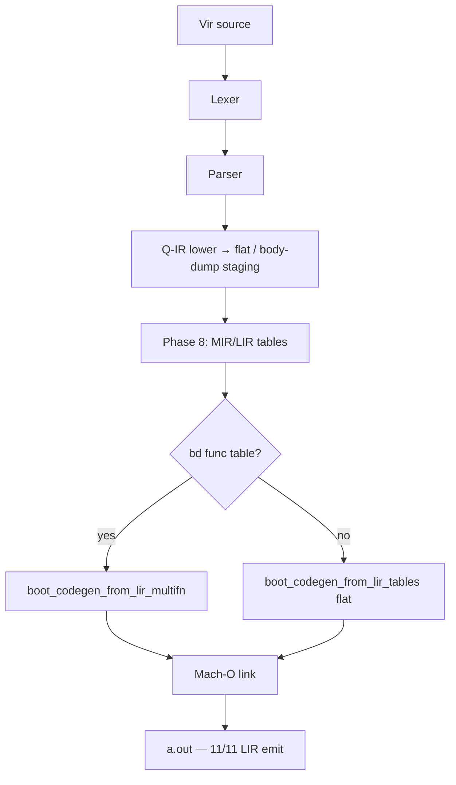

# Báo Cáo Tình Trạng Dự Án Vir v2.0
**Ngày:** 2026-07-25 02:40 (GMT+7)  
**Branch hiện tại:** `recovered_stash`  
**Trạng thái Pipeline (honest):** Bootstrap emit = **Q-IR staging → Phase-8 MIR/LIR flat tables → LIR Mach-O emit** (multifn Call/SetArg/PrintStr + flat const-fold). Q body-dump chỉ còn fallback khi thiếu metadata.

---

## 1. Kiến Trúc Bootstrap Thực Tế (`virc_boot.vri`)

**Ghi chú**
- Multifn LIR đọc opcode/operands từ `g_mir_*` (1:1 body-dump), bounds từ `g_bd_f*`.
- Flat LIR: const-fold Print cho single-stream staging.
- Q fallback chỉ khi Call thiếu `g_bd_nfuncs` hoặc PrintStr thiếu `g_bd_strdata`.

---

## 2. Bootstrap Suite (stdout + exit 0)

| Test | Emit path |
|------|-----------|
| cg_arith / cg_mul / cg_var | LIR-flat |
| cg_call / cg_call0 / cg_mod2 / cg_printstr | LIR-MF |
| cg_scale65_* / cg_scale70 | LIR-MF |

**11/11 PASS** — toàn bộ qua LIR emit (không còn Q+BD trong suite).

---

## 3. Commits gần đây

| Hash | Mô tả |
|------|--------|
| `58773cd3` | LIR-table Mach-O emit (Print/arith) + fix mir push reset |
| `431df9bc` | LIR multifn Call/SetArg/PrintStr — suite 11/11 LIR |

---

## 4. Việc còn lại

1. SSA/opt/regalloc trên flat tables.
2. Modular `virc.vri` driver ổn định.
3. Thu hẹp / xóa Q `boot_codegen_emit_mod_min` khi LIR multifn đủ cover self-host.
