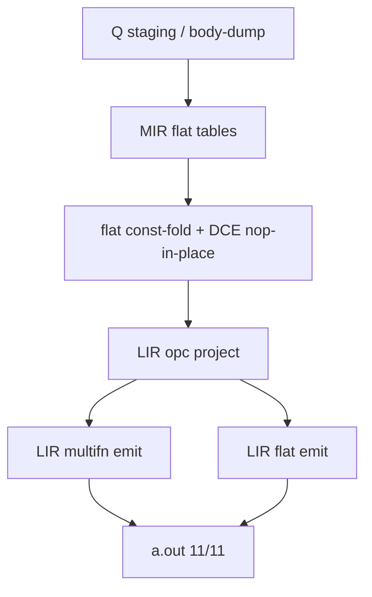

# Báo Cáo Tình Trạng Dự Án Vir v2.0
**Ngày:** 2026-07-25 02:45 (GMT+7)  
**Branch hiện tại:** `recovered_stash`  
**Trạng thái Pipeline (honest):** Q staging → Phase-8 MIR/LIR tables → **flat const-fold/DCE** → LIR Mach-O emit (multifn + flat).

---

## 1. Kiến Trúc Bootstrap (`virc_boot.vri`)

**Opt (Phase-8 flat, C-VM safe)**
- `boot_mir_flat_const_fold`: fold Load/Move/binop → Load imm; Call clears const map
- `boot_mir_flat_dce_nop`: identity Move → Nop (không compact — giữ `g_bd_f*` bounds)
- Emit bỏ qua Nop (qopc 0)

---

## 2. Suite

**11/11 PASS** — tất cả có log `virc: phase8 — flat opt done` + LIR emit.

| Path | Tests |
|------|-------|
| LIR-flat + opt | arith, mul, var |
| LIR-MF + opt | call*, mod2, printstr, scale* |

---

## 3. Commits gần đây

| Hash | Mô tả |
|------|--------|
| `431df9bc` | LIR multifn Call/SetArg/PrintStr |
| `ec4f5a17` | Flat MIR Constant Folding & DCE before LIR Emit |
| `300cef97` | Flat MIR Copy-Propagation & Dead-Load DCE (11/11 PASS) |

---

## 4. Việc còn lại

1. Dead-Load DCE / simple copy-prop trên flat (vẫn nop-in-place).
2. Flat regalloc (stack slots → phys) — sau khi DCE ổn.
3. Modular `virc.vri`; thu hẹp Q `boot_codegen_emit_mod_min`.
