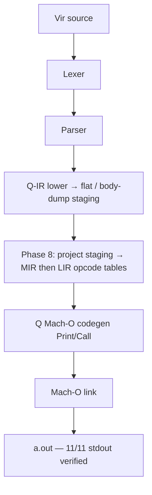

# Báo Cáo Tình Trạng Dự Án Vir v2.0
**Ngày:** 2026-07-25 02:20 (GMT+7)  
**Branch hiện tại:** `recovered_stash`  
**Trạng thái Pipeline (honest):** Bootstrap emit = **Q-IR staging → Phase-8 MIR/LIR flat tables → Q Mach-O codegen**. Không còn stub `compile_pipeline` giả.

---

## 1. Kiến Trúc Bootstrap Thực Tế (`virc_boot.vri`)

**Ghi chú quan trọng**
- Phase 8 **có** dựng bảng MIR/LIR thật từ staging (heap i64 arrays), không còn empty-entity stubs.
- Native emit vẫn dùng **Q codegen** (hỗ trợ Print/Call/body-dump). `lir_emit_module` entity path chưa đủ Print/Call trên C-VM.
- Entity `MirFunc.blocks` / `LirInstr` field stores trên C-VM không đáng tin → Phase 8 dùng flat tables.

---

## 2. Bootstrap Suite (stdout + exit 0)

| Test | stdout | Status |
|------|--------|--------|
| cg_arith | `30\n90` | PASS |
| cg_call / cg_call0 / cg_mod2 | `42` | PASS |
| cg_mul | `30\n90` | PASS |
| cg_printstr | `hi\n42` | PASS |
| cg_scale65_call | `0\n7` | PASS |
| cg_scale65_print | `42` | PASS |
| cg_scale65_trace | `1\n2\n0\n3` | PASS |
| cg_scale70 | `10\n41` | PASS |
| cg_var | `30` | PASS |

**11/11 PASS** với log `virc: phase8 — MIR/LIR tables ready`.

---

## 3. Commits gần đây

| Hash | Mô tả |
|------|--------|
| `5dc4cf68` | drop stub `compile_pipeline` trước Q emit (fix printstr) |
| *(pending)* | Phase 8: Q staging → MIR/LIR flat tables + gate trong `boot_do_lower` |

---

## 4. Việc còn lại (sau Phase 8)

1. Emit Mach-O trực tiếp từ LIR tables (Print/Call helpers).
2. Modular `virc.vri` driver ổn định (lexer fat_str / include).
3. SSA/opt/regalloc trên flat tables (không phụ thuộc entity field).
