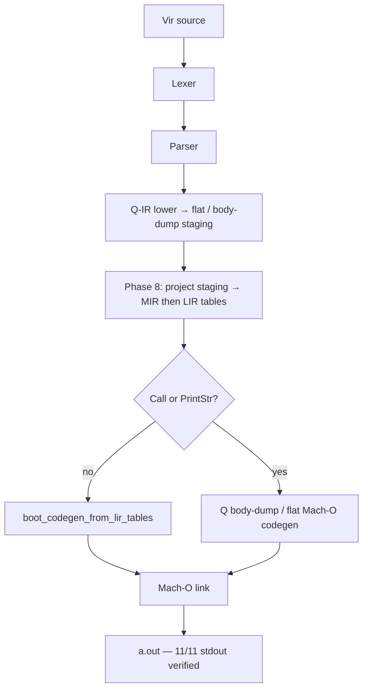

# Báo Cáo Tình Trạng Dự Án Vir v2.0
**Ngày:** 2026-07-25 02:30 (GMT+7)  
**Branch hiện tại:** `recovered_stash`  
**Trạng thái Pipeline (honest):** Bootstrap emit = **Q-IR staging → Phase-8 MIR/LIR flat tables → LIR-table Mach-O emit (no Call/PrintStr) hoặc Q body-dump fallback**.

---

## 1. Kiến Trúc Bootstrap Thực Tế (`virc_boot.vri`)

**Ghi chú quan trọng**
- Phase 8 dựng bảng MIR/LIR thật (heap i64). `boot_mir_push` chỉ `ensure` alloc — **không** reset `g_mir_n` mỗi push.
- Emit ưu tiên LIR tables khi stream không có Call/SetArg/PrintStr; còn lại fallback Q body-dump.
- Entity `MirFunc.blocks` / `LirInstr` trên C-VM vẫn không đáng tin → flat tables.

---

## 2. Bootstrap Suite (stdout + exit 0)

| Test | stdout | Emit path |
|------|--------|-----------|
| cg_arith / cg_mul / cg_var | `30\n90` / `30` | LIR |
| cg_mod2 / cg_scale65_print | `42` | LIR |
| cg_call / cg_call0 | `42` | Q+BD |
| cg_printstr | `hi\n42` | Q+BD |
| cg_scale65_call | `0\n7` | Q+BD |
| cg_scale65_trace | `1\n2\n0\n3` | Q+BD |
| cg_scale70 | `10\n41` | Q+BD |

**11/11 PASS** (codesign `a.out` trước khi chạy). Host: `core/build/vir` rebuild bằng `make -C core all`.

---

## 3. Commits gần đây

| Hash | Mô tả |
|------|--------|
| `5dc4cf68` | drop stub `compile_pipeline` trước Q emit |
| `ac9d8c4f` | Phase 8 MIR/LIR flat tables từ Q staging |
| `58773cd3` | LIR-table Mach-O emit + fix `boot_mir_push` reset bug |

---

## 4. Việc còn lại

1. LIR emit cho Call/SetArg và PrintStr (bỏ Q fallback).
2. Modular `virc.vri` driver ổn định.
3. SSA/opt/regalloc trên flat tables.
