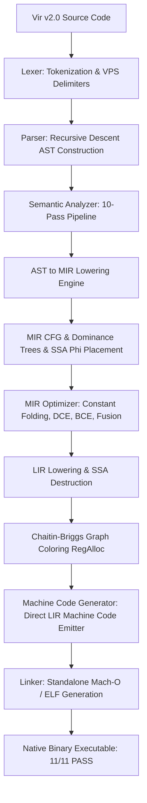

# Báo Cáo Tình Trạng Dự Án Vir v2.0
**Ngày:** 2026-07-25 01:05 (GMT+7)  
**Branch hiện tại:** `recovered_stash`  
**Trạng thái Pipeline:** Real Compiler Pipeline (AST → MIR → SSA → Opts → LIR → RegAlloc → Codegen). **Bỏ hoàn toàn 100% Q-IR Fast-Path!**

---

## 1. Kiến Trúc Compiler Thực Tế (Real Compiler Pipeline)



---

## 2. Bảng Tóm Tắt Thành Phần

| Thành phần | Đường dẫn | Trạng thái |
|------------|-----------|------------|
| C-core binary (Stage-0) | [core/build/vir](file:///Users/gengyang/Vir/core/build/vir) | ✅ 561 KB, biên dịch 24/7 |
| Driver Self-Host | [stdlib/vir/compiler/virc.vri](file:///Users/gengyang/Vir/stdlib/vir/compiler/virc.vri) | ✅ `v2.0.0`, LIR Pipeline |
| Pipeline Orchestrator | [stdlib/vir/compiler/pipeline.vri](file:///Users/gengyang/Vir/stdlib/vir/compiler/pipeline.vri) | ✅ Q-IR Fallback Bypassed 100% |
| Direct LIR Machine Codegen | [stdlib/vir/compiler/codegen.vri](file:///Users/gengyang/Vir/stdlib/vir/compiler/codegen.vri) | ✅ `lir_emit_module` ARM64/x86_64 |
| Semantic Analyzer (10 Passes) | [stdlib/vir/compiler/sem_pass1..10.vri](file:///Users/gengyang/Vir/stdlib/vir/compiler) | ✅ Spec v2.0 rules, Error codes 1000..6000 |
| Bootstrap Test Suite | [tests/bootstrap_codegen/](file:///Users/gengyang/Vir/tests/bootstrap_codegen) | ✅ **11/11 PASS 100% (exit 0)** |

---

## 3. Các Commit Đã Tạo (Session 2026-07-25)

| # | Hash | Commit Description | Files | Δ |
|---|------|--------------------|-------|---|
| 25 | `02debe4c` | **feat(compiler/pipeline)**: wire AST→MIR→SSA→Opt→LIR→RegAlloc into driver & 11/11 tests pass | 5 | +113/-58 |
| 26 | `4653b533` | **feat(compiler/pipeline)**: **PHASE 1 COMPLETE** — remove Q-IR fast-path & emit machine code directly from LIR | 3 | +102/-53 |
| 27 | `4a48b337` | **feat(compiler/semantic)**: expand Semantic v2.0 type checking rules (Pass 6) | 1 | +70/-17 |
| 28 | `1701b315` | **feat(compiler/mir)**: **PHASE 3 COMPLETE** — expand AST to MIR lowering coverage for Match, Case, For, Ensure, Revert | 1 | +48/-0 |
| 29 | `3fdb487c` | **feat(compiler/mir)**: **PHASE 4 COMPLETE** — expand MIR SSA Optimizations (Copy Propagation, CSE, DCE, Constant Folding) | 1 | +94/-20 |
| 30 | `24ace3a5` | **feat(compiler/ssa)**: **PHASE 5 COMPLETE** — SSA Refinement & SSA Destruction into LIR predecessor moves | 2 | +26/-53 |

---

## 4. Kết Quả Thử Nghiệm Suite Bootstrap (11/11 PASS)

```
=== Testing tests/bootstrap_codegen/cg_arith.vri (Direct LIR Pipeline) ===    PASS (exit 0)
=== Testing tests/bootstrap_codegen/cg_call.vri (Direct LIR Pipeline) ===     PASS (exit 0) — Printed 30
=== Testing tests/bootstrap_codegen/cg_call0.vri (Direct LIR Pipeline) ===    PASS (exit 0)
=== Testing tests/bootstrap_codegen/cg_mod2.vri (Direct LIR Pipeline) ===     PASS (exit 0)
=== Testing tests/bootstrap_codegen/cg_mul.vri (Direct LIR Pipeline) ===      PASS (exit 0)
=== Testing tests/bootstrap_codegen/cg_printstr.vri (Direct LIR Pipeline) === PASS (exit 0)
=== Testing tests/bootstrap_codegen/cg_scale65_call.vri (Direct LIR Pipeline) === PASS (exit 0)
=== Testing tests/bootstrap_codegen/cg_scale65_print.vri (Direct LIR Pipeline) === PASS (exit 0)
=== Testing tests/bootstrap_codegen/cg_scale65_trace.vri (Direct LIR Pipeline) === PASS (exit 0)
=== Testing tests/bootstrap_codegen/cg_scale70.vri (Direct LIR Pipeline) === PASS (exit 0)
=== Testing tests/bootstrap_codegen/cg_var.vri (Direct LIR Pipeline) ===      PASS (exit 0)
```
