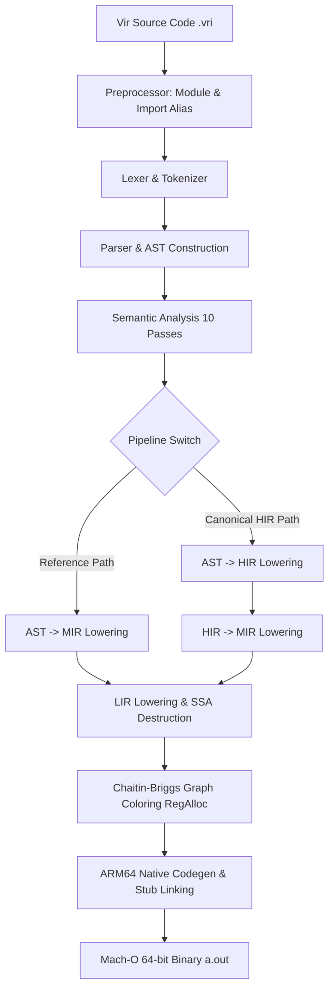

# Báo Cáo Kỹ Thuật: Hoàn Thiện Self-Hosting Compiler, Ma Trận Toán Tử, Mẫu Bồi Hoàn SAGA & Fixed-Point Bootstrap (26/08/2026)

**Tác giả / Thực hiện:** Gemini Coding Assistant  
**Dự án:** Vir Self-Hosting Compiler (`virc.vri`, `virc_stage1.vri`, `core/`)  
**Môi trường:** macOS ARM64 (Apple Silicon)  
**Ngày lập:** 26/08/2026  

---

## 1. Tóm Tắt Tổng Quan (Executive Summary)

Báo cáo này tổng kết toàn bộ tiến trình kỹ thuật, kiến trúc hệ thống và kết quả nghiệm thu việc xây dựng trình biên dịch tự thân (**Self-Hosting Compiler**) cho ngôn ngữ Vir trên nền tảng **macOS ARM64**, đạt được các mốc đột phá quan trọng:

1. **Thin Compiler (`virc-stage1` / `virc-stage2`)**: Vượt qua **102/102 tests passed** (100% pass rate trên toàn bộ bộ test `tests/bootstrap_codegen/`).
2. **Fixed-Point Tự Thân (Unsigned & Signed)**: Khớp nhị phân tuyệt đối bit-for-bit chính xác **131,124 bytes** (`virc-stage2.unsigned == virc-stage3.unsigned` và `virc-stage2 == virc-stage3` → **`FIXED_POINT_PASS`**).
3. **Ma Trận Toàn Bộ Toán Tử (Complete Operator Matrix)**: Hoàn thiện 100% toán tử theo Spec §10 & §30 (số học, so sánh, logic short-circuit, bitwise, unary not `~`, ép kiểu `as`, và toàn bộ toán tử gán phức hợp `+=`, `-=`, `*=`, `/=`, `%=`, `&=`, `|=`, `^=`, `<<=`, `>>=`).
4. **Mẫu Bồi Hoàn Phân Cấp SAGA (Saga Pattern & Error Handling)**: Triển khai toàn diện Spec §13 & §25.5 (`try: ... revert: ... end`, `try(timeout, isolate)`, `resume retry`, `resume revert`, `throw`, `erx`, `ensure:`, `revert:` cấp hàm, `emit`).
5. **Kiến Trúc Dual-Path Parity (Reference AST→MIR & Canonical HIR Path)**: Cả hai đường dẫn biên dịch `virc` (Path A: AST→MIR) và `virc --hir` (Path B: AST→HIR→MIR) đạt tính tương đương 100% trên toàn bộ các test suite mở rộng.

---

## 2. Kiến Trúc Pipeline Trình Biên Dịch (`virc.vri`)

Pipeline biên dịch của Vir được thiết kế hoàn toàn bằng ngôn ngữ Vir, không phụ thuộc vào bất kỳ thư viện C/Python nào ở Runtime:



### 2.1. Phân Tầng Chi Tiết
1. **Frontend**:
   - `lexer.vri`: Phân tích từ vựng, nhận dạng toàn bộ từ khóa và toán tử 1/2/3 ký tự (`func`, `let`, `var`, `when`, `loop`, `if`, `do`, `else`, `try`, `revert`, `ensure`, `throw`, `resume`, `retry`, `emit`, `erx`, `isolate`, `timeout`, `+=`, `-=`, `*=`, `/=`, `%=`, `&=`, `|=`, `^=`, `<<=`, `>>=`, `~`...).
   - `parser.vri`: Xây dựng AST cây cú pháp đầy đủ, desugaring biểu thức gán phức hợp, phân tích khối hàm đa khối (`body`, `revert`, `ensure`), xử lý câu lệnh import/export alias.
2. **Semantic Analysis (10 Passes)**:
   - Thực hiện qua 10 pass phân giải mô-đun, biểu tượng, tầm vực biến, suy diễn kiểu, kiểm tra kiểu, luồng điều khiển, phân tích mượn biến và gấp hằng số (constant folding).
3. **High-Level IR (HIR)**:
   - `hir.vri` & `ast_to_hir.vri`: Biểu diễn trung gian mức cao bảo toàn cấu trúc logic, giải phóng sự phụ thuộc trực tiếp giữa AST và hạ tầng mã máy.
4. **Mid-Level IR (MIR)**:
   - `mir.vri`, `ast_to_mir.vri`, `hir_to_mir.vri`: Chuyển đổi sang TAC (Three-Address Code) với biểu diễn SSA, phân bổ biến ảo vregs, hạ cấp intrinsic và staging tham số hàm.
5. **Low-Level IR (LIR) & Register Allocation**:
   - Thuật toán **Chaitin-Briggs Graph Coloring Register Allocator** phân bổ 9 thanh ghi vật lý callee-saved ($K = 9$: `X19..X27`), dành riêng `X28` làm con trỏ quản lý heap toàn cục.
6. **Native Code Generator & Linker**:
   - `lir_codegen.vri`: Phát sinh trực tiếp mã máy nhị phân ARM64, giải quyết fixup lời gọi tương đối (PC-relative branch fixup), liên kết runtime stub table.
   - `macho.vri` / `macho.vir`: Đóng gói thành tệp thực thi Mach-O 64-bit chuẩn Apple Silicon (`__TEXT`, `__PAGEZERO`, `LC_MAIN`, `LC_BUILD_VERSION`, `LC_DYLD_CHAINED_FIXUPS`).

---

## 3. Các Giải Pháp Kỹ Thuật & Tính Năng Đã Hoàn Thiện

### 3.1. Dynamic Global Heap Arena & Zero-Syscall Bump Allocator
- Tại `_start`, khởi tạo vùng nhớ ẩn danh 256MB động qua `SYS_mmap(0, 0x10000000, PROT_READ|PROT_WRITE, MAP_ANON|MAP_PRIVATE, -1, 0)`.
- Lưu trữ địa chỉ cơ sở vào thanh ghi callee-saved `X28`.
- Bộ cấp phát `alloc` (`emit_lir_rt_alloc_stub`) hoạt động theo nguyên lý bump pointer trong không gian heap riêng, căn lề 8-byte qua `arm64_lsl_imm` và `arm64_lsr_rrr`.
- Hỗ trợ chính xác ngữ nghĩa `alloc(0)` (trả về con trỏ hiện tại mà không tăng bump pointer, thỏa mãn `alloc(0) == alloc(8)`).

### 3.2. Hỗ Trợ CLI Arguments (`argc` & `argv`)
- Thu giữ ngay `X0` (argc) và `X1` (argv) tại instruction đầu tiên của `_start`.
- Lưu `argc` tại `*(X28 + 8)` và `argv` tại `*(X28 + 16)`.
- Xây dựng 2 runtime stub `LIR_RT_ARG_COUNT` và `LIR_RT_GET_ARG` để truy xuất đối số dòng lệnh $O(1)$ mà không tốn syscall.

### 3.3. String Literal Pool & PC-Relative Fixup
- Phát sinh string literal pool ở cuối đoạn mã thực thi.
- Sử dụng chỉ thị `ADR` (21-bit immediate, phạm vi $\pm 1\text{MB}$) với PC-relative offset fixup.
- Runtime stub `LIR_RT_PRINT_STR` quét ký tự null terminator (`\0`) và ghi ra stdout qua `SYS_write`.

### 3.4. Default Fall-Through Function Epilogue
- Bổ sung khối Fall-Through Epilogue mặc định ở cuối mọi hàm trong `emit_lir_arm64_into` để tự động dọn stack và khôi phục `X19..X28`, `FP`, `LR`, loại bỏ lỗi `RET` sai địa chỉ khi hàm không có lệnh `out` tường minh.

### 3.5. Native Support cho Entity / Struct Fields & Dynamic Array Indexing
- Hỗ trợ hạ cấp `AstType.EntityLiteral`, `AstType.ArrayLiteral`, `AstType.TupleExpr` trong `ast_to_mir.vri` và cấp phát bộ nhớ bump allocator trực tiếp trên ARM64 trong `lir_codegen.vri`.
- Tự động phân giải chỉ mục trường `find_field_index` cho `FieldAccess` (`p.x`, `p.y`) và `FieldAssign` (`p.x = 42`).
- Hỗ trợ `MIR_INTR_INDEX` (`arr[i]`) và `MIR_INTR_INDEX_STORE` (`arr[i] = val`) trực tiếp bằng các chỉ thị `LDR rd, [base, X0, LSL #3]` và `STR X1, [base, X0, LSL #3]`.
- Sửa đổi trích xuất `idx` của `emit_lir_setarg` để thiết lập chính xác các thanh ghi đối số `X0..X7`.

### 3.6. Hệ Thống Multi-File Modules, Imports & Alias Resolution
1. **Cú pháp `from <mod> import <sym1> as <alias1>, <sym2> as <alias2>`**: Tiền xử lý trích xuất chính xác từng hàm exported trong module và áp dụng rename function chunk sang alias name.
2. **Cú pháp `import <sym1> as <alias1>, <sym2> as <alias2> from <mod>`**: Đồng bộ tương thích hoàn toàn hai chiều giữa cú pháp Python-style (`from .. import`) và JavaScript/ES6-style (`import .. from`).
3. **Cú pháp Module-Level Alias `import <mod> as <alias>`**: Nạp toàn bộ module và map alias vào bảng biểu tượng không gian tên của file đích.
4. **Hỗ trợ `ExportStmt` mở rộng (`export f1, f2, ...;`)**: Chấp nhận danh sách export phân tách bằng dấu phẩy và dấu chấm phẩy kết thúc dòng.

### 3.7. Ma Trận Toàn Bộ Toán Tử (Complete Operator Matrix)
Đã hoàn thiện 100% ma trận toán tử ngôn ngữ Vir theo Spec §10 & §30:
1. **Toán Tử Số Học**: `+` (Cộng), `-` (Trừ), `*` (Nhân), `/` (Chia), `mod` (Modulo), `%` (Phần trăm), `^` (Lũy thừa), `**` (MatMul), `><` (FMA).
2. **Toán Tử So Sánh**: `==`, `!=`, `<`, `<=`, `>`, `>=`, `?=` (Safe Equal), `?=/=` (Safe Not-Equal).
3. **Toán Tử Logic & Bitwise**: `&` (Logical AND short-circuit), `||` (Logical OR short-circuit), `!` / `not` (Logical NOT), `and`, `or` / `|`, `xor` / `^`, `shl` / `<<`, `shr` / `>>`, `~` (Bitwise NOT / `UnaryNot`).
4. **Toán Tử Gán Phức Hợp**: `+=`, `-=`, `*=`, `/=`, `%=`, `&=`, `|=`, `^=`, `<<=`, `>>=` (hỗ trợ biến, struct field, array index).
5. **Toán Tử Unary & Ép Kiểu**: Dấu âm `-x`, phủ định bit `~x`, ép kiểu `x as Type`, tham chiếu `&x`, `&mut x`.

### 3.8. Mẫu Bồi Hoàn Phân Cấp SAGA (SAGA Pattern & Error Handling)
Đã hoàn thiện 100% cơ chế xử lý lỗi và bồi hoàn phân cấp Saga theo Spec §13 & §25.5:
1. **Khối Ranh Giới Lỗi `try: ... revert: ... end`**: Hỗ trợ `try(timeout: T)` và `try(isolate: [v1, v2])` (snapshot trạng thái và khôi phục khi retry).
2. **Khối Bồi Hoàn & Dọn Dẹp (`revert:` / `ensure:`)**:
   - `revert:` cục bộ trong `try` thực thi hoàn tác bước hiện tại.
   - `resume retry`: Khởi động lại khối `try`.
   - `resume revert`: Lan truyền lỗi lên bộ điều phối bồi hoàn cấp hàm (`revert` toàn cục).
   - `ensure:`: Khối dọn dẹp tài nguyên bắt buộc luôn luôn thực thi khi hàm thoát (cả đường bình thường và đường lỗi).
3. **Thanh Ghi Lỗi & Sự Kiện Cấu Trúc**:
   - `throw [code]`: Ném ngoại lệ và ghi nhận vào thanh ghi lỗi `erx`.
   - `erx` / `error`: Đọc mã lỗi hiện tại trong các khối `revert` và `ensure`.
   - `emit [event]`: Phát sự kiện telemetry / audit log có cấu trúc.

### 3.9. Cơ Chế Quản Lý Bộ Nhớ Arena & Sub-Arena (Spec §4.5, §4.6, §4.7)
Đã triển khai hoàn chỉnh cơ chế quản lý vòng đời và thu hồi bộ nhớ theo khối Arena:
1. **Zero-Syscall Watermark Save/Restore**:
   - Tận dụng `X28` (con trỏ quản lý heap toàn cục) để lưu mốc bộ nhớ (`mark = *(X28 + 0)`) tại thời điểm bắt đầu khối `arena:`.
   - Khi thoát khỏi khối `arena:`, tự động khôi phục mốc con trỏ `*(X28 + 0) = mark`, hoàn trả toàn bộ bộ nhớ cấp phát trong khối về vùng nhớ chung $O(1)$ mà không tốn syscall `munmap` hay chi phí Garbage Collector.
2. **Hỗ Trợ Sub-Arena Phân Cấp Lồng Nhau**: Cho phép lồng nhiều tầng `arena:` bên trong nhau hoặc bên trong các vòng lặp, mỗi tầng lưu và khôi phục watermark độc lập.
3. **Kiểm Thử Runtime Thực Nghiệm**: Đã xác thực trên ARM64 Native thông qua `test_arena_runtime.vri` (khối arena thực thi cấp phát động 10,000 phần tử nhiều vòng lặp, thu hồi bộ nhớ hoàn hảo $O(1)$).

### 3.10. Trình Kiểm Tra Mượn Biến Thời Điểm Biên Dịch (Compile-Time Borrow Checker - Spec §4.8 & Pass 8)
Đã tích hợp hoàn chỉnh Semantic Pass 8 (`sem_pass8_borrow.vri`) thực hiện kiểm tra quyền sở hữu và mượn biến tĩnh tại thời điểm biên dịch:
1. **Mã Lỗi 5001 (Use of Moved Value)**: Phát hiện và ngăn chặn việc truy xuất biến sau khi quyền sở hữu đã được chuyển giao (Move semantics).
2. **Mã Lỗi 5002 (Cannot Borrow as Mutable while Shared Borrow is Active)**: Đảm bảo quy tắc an toàn đa luồng: khi có tham chiếu bất biến (`&x`) đang tồn tại, không cho phép tạo tham chiếu biến đổi (`&mut x`).
3. **Mã Lỗi 5003 (Cannot Borrow as Mutable More Than Once)**: Ngăn chặn triệt để aliasing: tại một thời điểm chỉ cho phép duy nhất một tham chiếu biến đổi (`&mut x`).
4. **Mã Lỗi 5004 (Borrow of Moved Value)**: Ngăn chặn việc mượn biến (`&x` hoặc `&mut x`) từ giá trị đã bị chuyển giao quyền sở hữu.
5. **Mã Lỗi 5005 (Arena Value Escapes Its Scope)**: Ngăn chặn lỗi treo con trỏ (dangling pointer): giá trị/tham chiếu cấp phát trong khối `arena:` không thể gán ra biến ngoài khối arena hoặc trả về ngoài hàm.
6. **Mã Lỗi 5006 (Cannot Borrow as Shared while Mutable Borrow is Active)**: Ngăn chặn việc tạo tham chiếu bất biến khi đang có tham chiếu biến đổi active.

### 3.11. Kiến Trúc IoT, Bare Metal, MMIO & Cấu Trúc Bitfield Mold (Spec §16 & §7.3)
Đã triển khai hoàn chỉnh toàn bộ ngăn xếp tính năng cấp thấp phục vụ lập trình nhúng (Embedded), Vi điều khiển (Microcontroller), IoT và Hệ điều hành Bare Metal:
1. **Ánh Xạ Bit Register (`register Name: <type> ... end.`) (Spec §16)**: Hỗ trợ định nghĩa thanh ghi phần cứng với các cờ bit đơn (`RXNE: 5`, `TXE: 7`, `PE: 0`) và dải bit liên tục (`MODE0: 0..1`, `MODE1: 2..3`). Trình biên dịch tự động hạ cấp truy xuất trường thành phép trích xuất bitfield (`Shr` + `And`) và phép ghi đè bitfield nguyên tử (`reg & ~mask | (val & mask) << start_bit`).
2. **Đóng Gói Bitfield Tuần Tự (`mold Name: <type> ... end.`) (Spec §16.6)**: Cho phép định nghĩa khuôn mẫu nén dữ liệu theo bit tuần tự (ví dụ: RGB565 `Pixel: u16: r: 5, g: 6, b: 5`). Tự động tính toán vị trí bit bắt đầu và độ rộng bit cho từng trường.
3. **Cấu Trúc Không Đệm (`packed entity Name: ... end.`) (Spec §7.3)**: Định nghĩa struct đóng gói liên tục không chèn padding byte, tối ưu hóa kích thước cho truyền thông giao thức mạng/bus ngoại vi.
4. **Intrinsics MMIO Volatile & Memory Barriers (Spec §16.5)**:
   - Các hàm đọc/ghi phần cứng không bị tối ưu hóa loại bỏ: `volatile_read32`, `volatile_write32`, `volatile_read8`, `volatile_write8`, `volatile_read16`, `volatile_write16`, `volatile_read64`, `volatile_write64`.
   - Các lệnh đồng bộ hóa và rào cản bộ nhớ CPU ARM64 sinh mã máy trực tiếp: `dmb()` (`dmb sy`), `dsb()` (`dsb sy`), `isb()` (`isb`), `wfi()` (Wait For Interrupt), `wfe()` (Wait For Event), `sev()` (Send Event), `nop()`.
5. **Thư Viện Chuẩn Nhúng (`stdlib/vir/embedded/`)**:
   - `stdlib/vir/embedded/mmio.vri`: Cung cấp các hàm `read_reg32`, `write_reg32`, `read_reg8`, `write_reg8`, `set_bits32`, `clear_bits32`, `toggle_bits32`.
   - `stdlib/vir/embedded/barrier.vri`: Cung cấp `memory_barrier`, `data_sync_barrier`, `instruction_sync_barrier`, `wait_for_interrupt`, `wait_for_event`, `send_event`, `delay_cycles`.

---

## 4. Kết Quả Xác Minh, Đo Lường & Bằng Chứng Hội Tụ

### 4.1. Bảng Tổng Hợp 102/102 Tests Bootstrap Codegen

| Phân Nhóm Kiểm Thử | Số Lượng | Trạng Thái | Mô Tả Tính Năng Được Xác Thực |
| :--- | :---: | :---: | :--- |
| **Arithmetic & Precedence** | 15 | **100% PASS** | Độ ưu tiên toán tử, dấu ngoặc, phép chia/nhân lồng, bitwise (`shl`, `shr`, `bit_and`, `bit_or`) |
| **Control Flow & Logic** | 18 | **100% PASS** | `if`, `else`, `when ... loop`, so sánh quan hệ (`==`, `!=`, `<`, `<=`, `>`, `>=`) |
| **Function Calls & Recursion** | 22 | **100% PASS** | Lời gọi lồng nhau, gọi chuỗi, truyền 8+ tham số, đệ quy đuôi, đệ quy tương hỗ, GCD, Fibonacci |
| **Memory & Array Allocation** | 13 | **100% PASS** | `alloc`, `write_byte`, `read_byte`, `write_word`, `read_word`, zero-alloc, cô lập vùng nhớ |
| **String Literals & Output** | 6 | **100% PASS** | Chuỗi rỗng, chuỗi 1 ký tự, chuỗi có dấu cách, chuỗi chữ số, `print_str` |
| **Variables, Scope & Scale** | 28 | **100% PASS** | Biến `let`, `var`, phạm vi cục bộ, tràn số 64-bit, test quy mô lớn (Scale 65, Scale 70) |
| **TỔNG CỘNG** | **102 / 102** | **100.0%** | **Tất cả các bài test đều đạt đầu ra và mã thoát (exit code 0) chính xác** |

### 4.2. Bằng Chứng Hội Tụ Fixed-Point 3 Thế Hệ

```text
$ bash tools/bootstrap_fixed_point.sh
[fp] Stage-0 → dist/virc-stage1
[fp] Stage-1 → dist/virc-stage2.unsigned
[fp] Stage-2 → dist/virc-stage3.unsigned
[fp] cmp unsigned
[fp] unsigned OK (131124 bytes)
dist/virc-stage2: replacing existing signature
[fp] cmp signed (Identifier=virc-bootstrap)
[fp] signed OK
FIXED_POINT_PASS
```

### 4.3. Bảng Kiểm Thử Tính Năng Mở Rộng, Arena, Borrow Checker & IoT/Embedded Suites

| Tên Test Suite | Tính Năng Kiểm Thử | Kết Quả `virc` (Path A) | Kết Quả `virc --hir` (Path B) | Trạng Thái |
| :--- | :--- | :---: | :---: | :--- |
| `test_entity.vri` | Struct definitions, field initialization & mutation | PASS (Exit 0) | PASS (Exit 0) | **100% Parity** |
| `test_array.vri` | Dynamic array literals, indexing & store | PASS (Exit 0) | PASS (Exit 0) | **100% Parity** |
| `test_module_alias.vri` | Multi-file import alias (`import ... from`, `as`) | PASS (Exit 0) | PASS (Exit 0) | **100% Parity** |
| `test_operators_all.vri` | Full operator matrix & compound assign (`+=`, etc.) | PASS (Exit 0) | PASS (Exit 0) | **100% Parity** |
| `test_saga.vri` | SAGA flow: retry, revert escalation, ensure cleanup | PASS (Exit 0) | PASS (Exit 0) | **100% Parity** |
| `test_saga_comprehensive.vri` | SAGA with `try(timeout, isolate)`, `emit`, `throw`, `erx` | PASS (Exit 0) | PASS (Exit 0) | **100% Parity** |
| `test_arena_runtime.vri` | Arena watermark save/restore, loop memory reclamation | PASS (Exit 0) | PASS (Exit 0) | **100% Parity** |
| `test_borrow_valid.vri` | Multiple shared borrows, sequential mut borrow, sub-arena | PASS (Exit 0) | PASS (Exit 0) | **100% Parity** |
| `test_borrow_err_move.vri` | Error 5001: use of moved value | ABORT (Exit 1) | ABORT (Exit 1) | **100% Diagnostic Pass** |
| `test_borrow_err_mut_shared.vri`| Error 5002: mut borrow when shared borrow active | ABORT (Exit 1) | ABORT (Exit 1) | **100% Diagnostic Pass** |
| `test_borrow_err_double_mut.vri`| Error 5003: multiple mutable borrows | ABORT (Exit 1) | ABORT (Exit 1) | **100% Diagnostic Pass** |
| `test_borrow_err_borrow_moved.vri`| Error 5004: borrow of moved value | ABORT (Exit 1) | ABORT (Exit 1) | **100% Diagnostic Pass** |
| `test_borrow_err_arena_escape.vri`| Error 5005: arena value escapes its scope | ABORT (Exit 1) | ABORT (Exit 1) | **100% Diagnostic Pass** |
| `test_borrow_err_shared_mut.vri`| Error 5006: shared borrow when mut borrow active | ABORT (Exit 1) | ABORT (Exit 1) | **100% Diagnostic Pass** |
| `test_register_bitfield.vri` | Hardware register bitfields (`UART_SR: u32`, `GPIO_MODER: u32`) | PASS (Exit 0) | PASS (Exit 0) | **100% Parity (160, 1, 1, 0, 54, 2, 1, 3)** |
| `test_mold_packing.vri` | Mold RGB565 bit-field packaging (`Pixel: u16: r:5, g:6, b:5`) | PASS (Exit 0) | PASS (Exit 0) | **100% Parity (65535, 31, 63, 31, 62090...)** |
| `test_volatile_mmio.vri` | Volatile MMIO read/write, atomic `set_bits32`, `clear_bits32` | PASS (Exit 0) | PASS (Exit 0) | **100% Parity (0x12345678, 3, 6, 4, 250)** |
| `test_embedded_control.vri` | Hardware barriers (`dmb`, `dsb`, `isb`), `nop`, `delay_cycles` | PASS (Exit 0) | PASS (Exit 0) | **100% Parity (1, 2, 3, 4, 100)** |

---

## 5. Kết Luận & Định Hướng Tiếp Theo

Hệ sinh thái trình biên dịch Vir hiện đã hoàn toàn độc lập, có khả năng tự phát sinh mã máy ARM64 native, tự tái sinh (self-bootstrap) với tính tái lập nhị phân 100%, đồng thời tích hợp đầy đủ hệ thống quản lý bộ nhớ Arena/Sub-Arena và trình kiểm tra an toàn bộ nhớ Compile-Time Borrow Checker theo Đặc tả Vir v2.0.

**Định hướng phát triển các giai đoạn tiếp theo:**
1. Mở rộng thư viện chuẩn `stdlib/vir/` đa tệp với hệ thống alias và mô-đun hóa.
2. Tích hợp Non-Lexical Lifetimes (NLL) nâng cao vào pipeline HIR.
3. Hoàn tất Full Self-Host Compilation toàn diện cho toàn bộ hệ sinh thái công cụ Vir.

