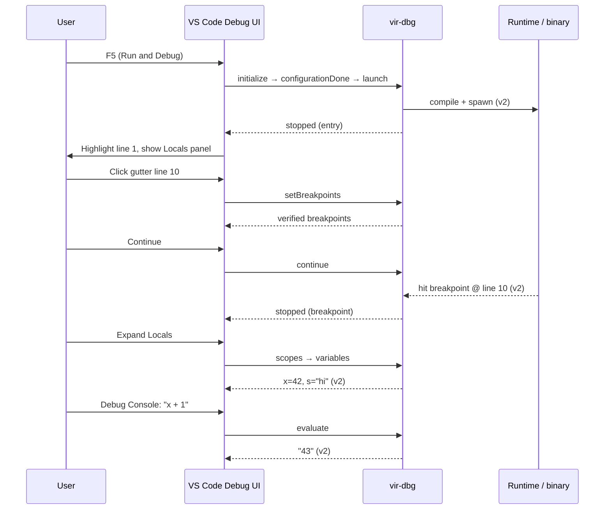

# Vir Debugger Specification

*Version 0.3 — August 26, 2026*  
*Status: **Stub / partial** — DAP adapter (Python) chạy được; **C core chưa có runtime debugger**; chỉ env trace + diagnostic compile-time*

---

## 1. Tổng quan

Vir debugger gồm **hai tầng** tách biệt:

| Tầng | Vị trí | Vai trò | Trạng thái |
|------|--------|---------|------------|
| **Debug Adapter (`vir-dbg`)** | `tools/vir-dbg/debugger.py` | Process DAP qua stdio; backend cho IDE Debug UI | Stub in-memory |
| **IDE Debug UI** | VS Code / Cursor (host) | Panel Variables, Call Stack, breakpoints — **chưa đăng ký** `type: vir` | Chưa ship |
| **Debug stdlib** | `stdlib/vir/debug/*.vri` | Types, source map, DWARF, unwind, trace, assert | Library code; hầu hết `extern` chưa có C backing |

**Không nhầm với:** [`MUST_READ_CONTEXT/SOFT_PATH_DEBUG_HANDOFF_2026_07_30.md`](../MUST_READ_CONTEXT/SOFT_PATH_DEBUG_HANDOFF_2026_07_30.md) — playbook debug **soft compiler** (`virc.vri`), không phải debugger cho end-user.

Roadmap gốc: [`PHASE3_ROADMAP_DETAILED.md`](PHASE3_ROADMAP_DETAILED.md) § F4 (source map + stack trace). Spec này mô tả **implementation hiện tại** và contract DAP đã implement.

---

## 2. Kiến trúc

```
┌─────────────────────────────────────────────────────────────┐
│  IDE Debug UI (VS Code — chưa đăng ký type: vir)             │
│       │ DAP stdio                                             │
│       ▼                                                     │
│  vir-dbg  (tools/vir-dbg/debugger.py)  ← Python, stub        │
│       ✕ chưa nối ────────────────────────────────────────  │
│       ▼                                                     │
│  core/build/vir  (C driver: main.c)                         │
│       │ lexer → parser → ir_lower → vm_exec_module          │
│       │ diagnostic.c (compile errors, JSON)                   │
│       │ vm.c: VIR_INTR_TRAP, VIR_VM_DEBUG log                 │
│       ✕ không có: debug.c, backtrace, DWARF emit, DAP       │
│       ▼                                                     │
│  stdlib/vir/debug/*.vri  (types only; extern chưa trong C)   │
└─────────────────────────────────────────────────────────────┘
```

**Hiện tại:** `vir-dbg` (Python) và **C runtime** hoạt động độc lập. C core **không implement** `native_backtrace_*`, `dap_server_*`, hay breakpoint tại source line. Xem § 2.1.

### 2.1 C Core (`core/`) — inventory debug

**Không tồn tại:** `core/src/debug.c`, DWARF emitter, source-map writer, signal handler cho stack trace, DAP server, ptrace attach.

| Thành phần | File | Chức năng | Liên quan debugger? |
|------------|------|-----------|---------------------|
| **Q-IR line slot** | `core/include/q_ir.h` | `q_instruction_t.line` — field debug | ⚠️ **Luôn 0** — `q_instr()` zero-init; `ir_lower.c` không gán |
| **Trap / abort** | `core/src/vm.c`, `vm.h` | `VIR_INTR_TRAP` (id 11) → `abort()` | Programmatic stop, không map source |
| **`__trap` builtin** | `core/src/parser.c`, `ir_lower.c` | `BUILTIN_TRAP` → emit `Q_INTRINSIC` trap | Tương đương `abort()` từ Vir source |
| **VM status** | `core/src/vm.c` | `vm_status_str()` — `ERR_DIV_ZERO`, `ERR_BAD_JUMP`, … | **Không** kèm file:line khi runtime lỗi |
| **VM debug log** | `core/src/vm.c` | `VIR_VM_DEBUG=1` → `/tmp/vm_dbg.log` | Trace `LOADG`/`STOREG` cho `vir_alloc`/`heap_*`; cảnh báo duplicate label |
| **Compiler trace** | `core/src/main.c` | `VIR_TRACE_STAGE1`, `VIR_TRACE_TIMING`, `VIR_TRACE_FILE` | Phase timing lexer/parser/vm — **không** phải debug program |
| **IR lower debug** | `core/src/ir_lower.c` | `VIR_DEBUG_COMPILER`, `VIR_INCLUDE_DEBUG` | stderr khi lower lỗi / include graph |
| **Diagnostic engine** | `core/src/diagnostic.c`, `diagnostic.h` | Span file+line+col, terminal/JSON sink | **Compile-time** only; LSP/tooling, không runtime step |
| **Borrow CFG export** | `core/src/borrow_check.c` | `borrow_build_cfg()` — inspect CFG | Dev/internal, không user debugger |
| **Q-IR text dump** | `core/src/q_ir.c` | `q_module_dump()` | Disassembly Q-IR **không in** `.line` |
| **Debug build** | `core/Makefile` | `DEBUG=1` → `-g -O0 -DDEBUG -fsanitize=address` | gdb/lldb trên **C VM**, không source `.vri` |

#### Trap intrinsic (runtime stop duy nhất trong C)

```c
/* vm.c */
static void intr_trap(vir_intrinsic_ctx_t *ctx) {
    (void)ctx;
    abort();
}
/* vir_intr_table[11]: { intr_trap, 0, INTR_IMPURE | INTR_TRAP, "trap" } */
```

Vir source: `__trap()` / `__unreachable()` → `BUILTIN_TRAP` → `Q_INTRINSIC(VIR_INTR_TRAP)`.

#### `VIR_VM_DEBUG` — VM execution log (không phải DAP)

```bash
VIR_VM_DEBUG=1 ./core/build/vir run program.vri
# → /tmp/vm_dbg.log: LOADG/STOREG trong vir_alloc, heap_alloc, heap_init
# → stderr: duplicate Q_LABEL warnings
```

Không log mọi opcode; không in source line (vì `instr->line == 0`).

#### Compile pipeline trace (`main.c`)

```bash
VIR_TRACE_STAGE1=1 VIR_TRACE_FILE=/tmp/stage1.log ./core/build/vir compile foo.vri
```

Ghi các phase: `lexer_start/end`, `parser_start/end`, `vm_init`, `runtime_execution_end` kèm `status=` và `vm_steps=`. Dùng profile bootstrap, không thay debugger.

#### Runtime error output (`main.c`)

Khi `vm_exec_module` fail:

```
runtime error: ERR_BAD_JUMP_TARGET
[vir] VM status: ERR_BAD_JUMP_TARGET  (12345 instrs)
```

**Không có** stack trace, function name, hay `.vri` line — chỉ enum string từ `vm_status_str()`.

#### Q-IR line field — chưa wired

```c
/* q_ir.h */
typedef struct {
    ...
    uint32_t line;      /* Source line (debug info) */
} q_instruction_t;

/* q_ir.c — q_instr() */
q_instruction_t instr = {0};  /* .line stays 0 */
```

Để debugger C-side hoạt động, cần: `emit()` trong `ir_lower.c` set `instr.line = node->line` (và file id trong module).

#### Diagnostic engine vs debugger

| | `diagnostic.c` | Runtime debugger |
|--|----------------|------------------|
| Thời điểm | Compile | Execute |
| Output | Structured errors + snippet | Break / step / variables |
| Line info | ✅ AST span | ❌ chưa |
| JSON | ✅ schema for tooling | ❌ |
| DAP | ❌ | Target qua `vir-dbg` |

`DIAG_DEBUG` severity tồn tại trong `diagnostic.h` — trace compiler nội bộ, không expose qua IDE debug panel.

#### Extern thiếu cho `stdlib/vir/debug/trace.vri`

C core **không export** các symbol mà stdlib khai báo:

- `native_backtrace_depth`, `native_backtrace_addr`, `_symbol`, `_file`, `_line`
- `native_install_fault_handler`, `native_abort` (abort có qua trap intrinsic, không qua Vir extern tên đó)
- `dap_server_start`, `dap_send_event`, …

→ `trace.vri` / `dap.vri` **không chạy được** trên C-VM hiện tại.

**Hiện tại (tóm):** C core = VM interpreter + compile diagnostics + env-gated logs. **Không** nối `vir-dbg`, **không** UI, **không** source-level runtime debug.

---

## 3. Giao diện debugger (UI)

### 3.1 Hiện trạng — chưa có UI tích hợp

| Kênh | Trạng thái | Mô tả |
|------|------------|-------|
| **VS Code / Cursor Debug view** | ❌ Chưa có | Extension `tools/vscode-vir` (`virgori-core`) chỉ có grammar, LSP, themes — **không** contribute `debuggers` |
| **vir-dbg stdio** | ✅ Có | Chỉ JSON qua stdin/stdout; không render UI — client (IDE hoặc script) phải vẽ |
| **Terminal crash trace** | ⚠️ Thiết kế | `stdlib/vir/debug/trace.vri` → stderr khi `log_fatal` / fault handler (native chưa wired) |
| **lldb / gdb** | ⚠️ Thiết kế | Qua DWARF trong binary (`dwarf.vri`); chưa emit debug sections thật |

**Kết luận:** Debugger **không có giao diện riêng** (không web UI, không TUI, không panel custom). Toàn bộ UX mục tiêu dựa trên **Debug Adapter Protocol** → IDE host (VS Code) vẽ UI chuẩn.

### 3.2 Kiến trúc UI mục tiêu (DAP client)

Vir **không viết UI từ đầu**. Host IDE (VS Code, Cursor, JetBrains qua plugin) implement [Debug UI](https://code.visualstudio.com/docs/editor/debugging); `vir-dbg` chỉ là adapter backend.

```
┌──────────────────────────────────────────────────────────────────────────┐
│  VS Code / Cursor                                                         │
│  ┌─────────────┐  ┌────────────────────────────────────────────────────┐ │
│  │ Run & Debug │  │  Editor (.vri)                                      │ │
│  │  ▶ Continue │  │  ● breakpoint gutter (line 10)                      │ │
│  │  ⤵ Step Over│  │  → yellow execution arrow (current line)            │ │
│  │  ↳ Step Into│  │  hover: evaluate expression (DAP evaluate)          │ │
│  │  ⤴ Step Out │  └────────────────────────────────────────────────────┘ │
│  └─────────────┘  ┌──────────────┐  ┌──────────────┐  ┌─────────────────┐ │
│  VARIABLES        │ CALL STACK   │  │ BREAKPOINTS  │  │ DEBUG CONSOLE   │ │
│  ▼ Locals         │ main:42      │  │ ✓ foo.vri:10 │  │ > x + 1         │ │
│    x = 42         │ helper:18    │  │   cond: n>0  │  │ 43              │ │
│    s = "hi"       │              │  │              │  │                 │ │
│  ▼ Globals (v2)   │              │  │              │  │                 │ │
│  WATCH            │              │  │              │  │                 │ │
│  arr.len          │              │  │              │  │                 │ │
└───────────────────┴──────────────┴──────────────┴──┴─────────────────┘ │
         │ launch.json  "type": "vir"                                         │
         │ DebugAdapterExecutable → python3 tools/vir-dbg/debugger.py         │
         └────────────────────────────────────────────────────────────────────┘
```

### 3.3 Ánh xạ panel IDE ↔ DAP ↔ adapter hiện tại

| Panel / control IDE | DAP request / event | Dữ liệu adapter trả (hiện tại) | Ghi chú |
|---------------------|---------------------|----------------------------------|---------|
| **Run / F5** | `launch` | Event `stopped` reason `entry`; frame `<main>` line 1 | Không compile/chạy binary |
| **Continue** | `continue` | `allThreadsContinued: true`; không event stopped | |
| **Step Over (F10)** | `next` | Event `stopped` reason `step`; top frame `line += 1` | Stub — không execute bytecode |
| **Step Into (F11)** | `stepIn` | Event `stopped` reason `step` | Không push frame callee |
| **Step Out (⇧F11)** | `stepOut` | Event `stopped`; `pop_frame()` | |
| **Breakpoint gutter** | `setBreakpoints` | `{ id, verified: true, line }` | Luôn verified; không hit thật |
| **Execution arrow** | Event `stopped` | IDE highlight `stackFrames[0].line` | Sau launch/step |
| **CALL STACK** | `stackTrace` | `stackFrames[]`: id, name, source.path, line, column | Thường 1 frame `<main>` |
| **VARIABLES → Locals** | `scopes` → `variables` | Scope `"Locals"`; **variables: []** | Rỗng — chưa đọc memory |
| **WATCH** | `evaluate` | `result: "<eval:expr>"` | Placeholder |
| **Hover value** | `evaluate` (context `hover`) | Cùng placeholder | `supportsEvaluateForHovers: true` |
| **DEBUG CONSOLE** | `evaluate` (context `repl`) | Cùng placeholder | |
| **Threads** | `threads` | `[{ id: 1, name: "main" }]` | Single-thread |
| **Stop / Disconnect** | `disconnect` | `_running = false` | |

**Màu / icon gutter (VS Code mặc định):**

| Trạng thái | Hiển thị editor |
|-----------|-----------------|
| Breakpoint verified | Chấm đỏ cột trái |
| Breakpoint unverified (v2) | Chấm xám (khi adapter trả `verified: false`) |
| Current instruction | Mũi tên vàng + highlight dòng |
| Stopped on exception (v2) | Panel CALL STACK + message exception |

### 3.4 Cấu hình launch (target — chưa ship)

File `.vscode/launch.json` dự kiến:

```json
{
  "version": "0.2.0",
  "configurations": [
    {
      "name": "Debug Vir program",
      "type": "vir",
      "request": "launch",
      "program": "${file}",
      "compiler": "${workspaceFolder}/core/build/vir",
      "cwd": "${workspaceFolder}",
      "stopOnEntry": true,
      "env": {}
    },
    {
      "name": "Debug Vir (attach)",
      "type": "vir",
      "request": "attach",
      "processId": "${command:pickProcess}"
    }
  ]
}
```

Extension contribution dự kiến trong `tools/vscode-vir/package.json`:

```json
"debuggers": [
  {
    "type": "vir",
    "label": "Vir Debug",
    "languages": ["vir"],
    "configurationAttributes": {
      "launch": {
        "required": ["program"],
        "properties": {
          "program": {
            "type": "string",
            "description": "Absolute path to .vri entry file",
            "default": "${file}"
          },
          "compiler": {
            "type": "string",
            "description": "Path to vir compiler driver",
            "default": "vir"
          },
          "stopOnEntry": {
            "type": "boolean",
            "default": true
          },
          "args": {
            "type": "array",
            "items": { "type": "string" },
            "default": []
          }
        }
      }
    },
    "initialConfigurations": [
      {
        "name": "Debug Vir",
        "type": "vir",
        "request": "launch",
        "program": "${file}"
      }
    ],
    "configurationSnippets": [
      {
        "label": "Vir: Launch current file",
        "body": {
          "name": "Debug ${1:${TM_FILENAME}}",
          "type": "vir",
          "request": "launch",
          "program": "^\"\\${file}\""
        }
      }
    ]
  }
],
"breakpoints": [
  { "language": "vir" }
]
```

Adapter process (stdio):

```json
"adapter": {
  "type": "executable",
  "command": "python3",
  "args": ["${workspaceFolder}/tools/vir-dbg/debugger.py"]
}
```

*(Cú pháp chính xác có thể dùng `DebugAdapterDescriptorFactory` trong `extension.ts` thay vì inline `adapter` — tùy phiên bản VS Code API.)*

### 3.5 Luồng tương tác người dùng (target v1)



**v0 (hiện tại):** bước `RT` bị bỏ qua; Locals rỗng; evaluate trả placeholder.

### 3.6 Giao diện thay thế (không qua IDE)

| Công cụ | Khi dùng | Output |
|---------|----------|--------|
| **`trace.vri` / `print_trace()`** | Crash, `log_fatal`, SIG handler | Text stderr: `func at file:line [0xaddr]` |
| **`lldb` / `gdb`** | Native binary có DWARF | CLI full-featured (break, watch, disasm) |
| **`coredump.vri`** | Post-mortem | Parse core file → thread/register dump (text/REPL script) |
| **Script DAP** | CI / headless test | Python gửi JSON như § 6.4 — không UI |

Không có kế hoạch **Vir Debug GUI** riêng (Electron/TUI) trong roadmap hiện tại; IDE DAP là canonical UX.

### 3.7 Trạng thái hiển thị theo `stop_reason`

| `stopped.body.reason` | UI IDE (typical) | Adapter hiện tại |
|----------------------|------------------|------------------|
| `entry` | Dừng tại `main`, line 1 | ✅ Sau `launch` |
| `breakpoint` | Message "Paused on breakpoint" | ❌ Không phát sinh |
| `step` | Sau F10/F11/⇧F11 | ✅ Stub (line +1 hoặc pop) |
| `exception` | Exception widget + stack | ❌ Chưa implement |
| `pause` | User Pause button | ❌ Chưa có `pause` command |

---

## 4. Giao thức vận chuyển (Transport)

Tuân theo [Debug Adapter Protocol](https://microsoft.github.io/debug-adapter-protocol/) base protocol:

1. Client gửi header `Content-Length: N` + `\r\n\r\n` + JSON body.
2. Adapter trả **một `response`** cho mỗi `request`.
3. Nếu `DebugState.stopped == true` sau khi xử lý request, adapter **tự gửi thêm** event `stopped` (xem § 6.3).

Message types:

| `type` | Hướng | Mô tả |
|--------|-------|-------|
| `request` | Client → Adapter | Lệnh DAP (`command` field) |
| `response` | Adapter → Client | Kết quả; `success`, `body`, `request_seq` |
| `event` | Adapter → Client | Ví dụ `stopped` |

---

## 5. Trạng thái nội bộ (`DebugState`)

```python
DebugState:
  breakpoints: dict[file_path → list[Breakpoint]]
  frames:        list[StackFrame]          # call stack
  variables:     dict[scope_id → list[Variable]]
  stopped:       bool
  stop_reason:   entry | breakpoint | step | exception
```

| Type | Fields |
|------|--------|
| `Breakpoint` | `id`, `file`, `line`, `verified` (default `true`), `condition?` |
| `StackFrame` | `id`, `name`, `file`, `line`, `column` (default 0) |
| `Variable` | `name`, `value`, `type`, `ref` (child scope id; 0 = leaf) |

Counter nội bộ: `_bp_counter`, `_frame_counter`, `_scope_counter` — tăng monotonic, không reuse id.

**API nội bộ (chưa expose qua DAP):**

- `add_breakpoint`, `remove_breakpoint`, `check_breakpoint(file, line)`
- `push_frame`, `pop_frame`
- `set_variables(scope_id, variables)`, `new_scope()`

Không có lệnh DAP nào cho phép client **inject variables**; `variables` luôn rỗng trừ khi code Python khác gọi `set_variables`.

---

## 6. Lệnh DAP — Request / Response / Event

### 6.1 Bảng tóm tắt

| Command | Hỗ trợ | Side effects |
|---------|--------|--------------|
| `initialize` | ✅ | `_initialized = true`; trả capabilities |
| `configurationDone` | ✅ | No-op |
| `launch` | ✅ (stub) | `_running=true`, `stopped=true`, reason `entry`, push frame `<main>` |
| `setBreakpoints` | ✅ | Xóa BP cũ theo file; thêm BP mới; **không** verify với source thật |
| `threads` | ✅ | Luôn 1 thread `main` id=1 |
| `stackTrace` | ✅ | Trả `frames` đảo ngược (leaf trước) |
| `scopes` | ✅ | Một scope `"Locals"`; `variablesReference` = scope id mới |
| `variables` | ✅ | Lookup `variablesReference` → list (thường rỗng) |
| `continue` | ✅ | `stopped=false` |
| `next` | ✅ (stub) | `stopped=true`, reason `step`; **tăng `line` frame top +1** |
| `stepIn` | ✅ (stub) | `stopped=true`, reason `step`; không push frame |
| `stepOut` | ✅ (stub) | `pop_frame()`; `stopped=true`, reason `step` |
| `evaluate` | ✅ (stub) | Trả `"<eval:{expr}>"`; không lookup biến |
| `disconnect` | ✅ | `_running=false` |
| *(khác)* | ❌ | `success=false`, `message="Unknown command: …"` |

Capabilities (`initialize` body):

```json
{
  "supportsConfigurationDoneRequest": true,
  "supportsFunctionBreakpoints": false,
  "supportsConditionalBreakpoints": true,
  "supportsEvaluateForHovers": true,
  "supportsStepBack": false,
  "supportsSetVariable": false
}
```

`supportsConditionalBreakpoints: true` nhưng **`condition` không được evaluate** — chỉ lưu trên `Breakpoint`.

### 6.2 Chi tiết từng lệnh

#### `initialize`

**Response body:** capabilities (§ 6.1).  
**Event:** không.

#### `configurationDone`

**Response body:** `{}`.

#### `launch`

**Arguments:**

| Field | Kiểu | Bắt buộc | Xử lý |
|-------|------|----------|-------|
| `program` | string | khuyến nghị | Gán `StackFrame.file`; không mở/compile file |

**Response body:** `{}`.  
**Event:** `stopped` reason `"entry"`, `threadId: 1`, `allThreadsStopped: true`.

Frame khởi tạo: `{ name: "<main>", file: program, line: 1, column: 0 }`.

#### `setBreakpoints`

**Arguments:**

```json
{
  "source": { "path": "/abs/path/file.vri" },
  "breakpoints": [
    { "line": 10, "condition": "optional — ignored at runtime" }
  ]
}
```

**Response body:**

```json
{
  "breakpoints": [
    { "id": 1, "verified": true, "line": 10 }
  ]
}
```

Mọi BP mới đều `verified: true` dù chưa map instruction.  
**Event:** nếu vẫn `stopped`, gửi thêm `stopped` (thường reason vẫn là `entry`).

#### `stackTrace`

**Arguments:** `threadId` (ignored — single-thread stub).

**Response body:**

```json
{
  "stackFrames": [
    {
      "id": 1,
      "name": "<main>",
      "source": { "path": "/path/to/program.vri" },
      "line": 1,
      "column": 0
    }
  ],
  "totalFrames": 1
}
```

#### `scopes`

**Arguments:** `frameId` (ignored).

**Response body:**

```json
{
  "scopes": [
    {
      "name": "Locals",
      "variablesReference": 1,
      "expensive": false
    }
  ]
}
```

Mỗi lần gọi tạo **scope id mới** (`new_scope()`).

#### `variables`

**Arguments:** `variablesReference` (int).

**Response body:**

```json
{
  "variables": [
    {
      "name": "x",
      "value": "42",
      "type": "int",
      "variablesReference": 0
    }
  ]
}
```

Hiện tại adapter **không populate** variables → thường `"variables": []`.

#### `continue` / `next` / `stepIn` / `stepOut`

| Command | `stopped` sau | `stop_reason` | Ghi chú |
|---------|---------------|-----------------|---------|
| `continue` | `false` | — | Không gửi `stopped` |
| `next` | `true` | `step` | Top frame `line += 1` |
| `stepIn` | `true` | `step` | Không đổi stack |
| `stepOut` | `true` | `step` | `pop_frame()` nếu có |

**Response body:** `continue` trả `{ "allThreadsContinued": true }`; step commands trả `{}`.

#### `evaluate`

**Arguments:** `expression`, optional `frameId`.

**Response body:**

```json
{
  "result": "<eval:x>",
  "variablesReference": 0
}
```

Placeholder — không parse/eval Vir expression.

#### `disconnect`

**Response body:** `{}`. Vòng lặp stdio có thể tiếp tục cho đến EOF stdin.

### 6.3 Event `stopped`

Gửi **sau mỗi response** nếu `state.stopped == true`:

```json
{
  "seq": <int>,
  "type": "event",
  "event": "stopped",
  "body": {
    "reason": "entry" | "breakpoint" | "step" | "exception",
    "threadId": 1,
    "allThreadsStopped": true
  }
}
```

**Hành vi hiện tại cần lưu ý:**

- Sau `launch`, mọi request khi vẫn stopped (kể cả `setBreakpoints`, `stackTrace`) đều kèm thêm `stopped` → client có thể nhận event trùng lặp.
- `check_breakpoint()` tồn tại nhưng **không được gọi** từ step/launch — breakpoint không bao giờ trigger reason `"breakpoint"`.

### 6.4 Ví dụ phiên (rút gọn)

```
Client → initialize
Adapter → response (capabilities)

Client → configurationDone
Adapter → response {}

Client → launch { program: "test.vri" }
Adapter → response {}
Adapter → event stopped { reason: "entry" }

Client → stackTrace
Adapter → response { stackFrames: [{ name:"<main>", line:1, ... }] }
Adapter → event stopped { reason: "entry" }   // vì vẫn stopped

Client → next
Adapter → response {}
Adapter → event stopped { reason: "step" }
// stackTrace lúc này: line 2 (stub +1)
```

Chạy thử:

```bash
python3 tools/vir-dbg/debugger.py   # đọc DAP từ stdin
```

---

## 7. Stdlib `vir/debug` — Module & contract

Các module Vir **song song** với DAP adapter; dự kiến runtime/compiler sẽ dùng khi nối debugger thật.

### 7.1 `dap.vri` — DAP types (Vir)

| Export | Mô tả |
|--------|-------|
| `StopReason` | Entry, Breakpoint, Step, Pause, Exception, Exit |
| `DapBreakpoint`, `DapStackFrame`, `DapScope`, `DapVariable`, `DapSource` | Entity mirror DAP |
| `DapRequest`, `DapResponse`, `DapEvent` | `arguments`/`body` là JSON string |
| `dap_capabilities()` | JSON string capabilities (subset) |
| `dap_server_start/stop`, `dap_send_event`, `dap_send_response` | **extern** — chưa implement trong `core/` |

### 7.2 `trace.vri` — Stack trace & logging

| API | Hành vi (khi có native backing) |
|-----|--------------------------------|
| `capture_trace()` | Walk stack qua `native_backtrace_*` |
| `trace_to_string`, `print_trace` | Format `func at file:line [0xaddr]` |
| `log_*`, `log_fatal` | Level-filtered stderr; fatal → trace + `native_abort` |
| `install_fault_handler()` | SIGSEGV/SIGBUS/SIGFPE → trace |

**Native symbols cần:** `native_backtrace_depth`, `_addr`, `_symbol`, `_file`, `_line`, `native_abort`, `native_install_fault_handler`.

### 7.3 `unwind.vri` — Unwind & symbolication

| API | Mô tả |
|-----|-------|
| `StackFrame` | pc, sp, fp, func_name, file, line, is_inline |
| `SymbolTable` / `sym_lookup` | Map PC → symbol |
| CFI constants | DWARF `.eh_frame` style rules (data structures) |

Chưa nối libunwind / DWARF CFI thật.

### 7.4 `sourcemap.vri` — Source Map v3

| API | Mô tả |
|-----|-------|
| `SourceMapping`, `SourceMap` | gen_line/col ↔ src file/line/col |
| `sm_encode_mappings` | VLQ encode (Spec v3) |
| `sm_to_json` | Emit JSON source map |

Dùng cho map **generated code offset → Vir source** (compiler emit).

### 7.5 `dwarf.vri` — DWARF debug info

Emit sections `.debug_info`, `.debug_abbrev`, `.debug_line` (constants DW_TAG_*, form encodings). Compiler backend ghi vào object file để lldb/gdb đọc source-level debug.

### 7.6 `coredump.vri` — Post-mortem

Parse Mach-O / ELF core: threads, registers (ARM64), memory regions. Phân tích offline sau crash.

### 7.7 `assert.vri` — Assertions

`assert`, `assert_eq_*`, `debug_assert` — panic + message; dùng nội bộ compiler passes.

---

## 8. Debug info trong artifact binary

[`FILE_FORMATS.md`](FILE_FORMATS.md) — flag SRI bit 0 `has_debug_info`. Khi set, binary có thể chứa symbol/debug metadata. **Chưa** document chi tiết section layout trong repo; DWARF/source map là hướng implement.

Luồng mục tiêu (chưa wired):

```
Compiler (MIR/LIR codegen)
  → ghi SourceMap / DWARF / symtab
  → embed hoặc sidecar .map
Runtime stop / crash
  → unwind + sourcemap lookup
  → vir-dbg hoặc trace.vri in human-readable location
```

---

## 9. Hạn chế hiện tại

| # | Hạn chế |
|---|---------|
| 1 | Không execute program — `launch` không chạy `vir` hay binary |
| 2 | Breakpoint không bind instruction; reason `breakpoint` không xảy ra |
| 3 | Variables / scopes rỗng — không đọc register/stack/memory |
| 4 | Single thread hardcoded |
| 5 | `evaluate` placeholder |
| 6 | Conditional breakpoint lưu nhưng không evaluate |
| 7 | `stepIn` không vào function; không có nested frames thật |
| 8 | Event `stopped` duplicate khi `stopped==true` |
| 9 | Stdlib `extern` DAP/backtrace chưa có trong C core (§ 2.1) |
| 10 | VS Code extension chưa contribute `debuggers` → không launch từ IDE (xem § 3) |
| 11 | `q_instruction_t.line` luôn 0 — ir_lower không emit source loc |
| 12 | Runtime lỗi VM chỉ in `vm_status_str`, không stack/file:line |

---

## 10. Lộ trình implement (target spec v1)

Thứ tự đề xuất, giữ MIR/LIR pipeline hiện tại:

| Phase | Deliverable | Ghi chú |
|-------|-------------|---------|
| **A0** | Gán `instr.line` trong `ir_lower.c` `emit()` | Prerequisite C-side |
| **A** | Source locations trên MIR/LIR ops (soft path) | Song song thin C |
| **B** | `sourcemap.vri` emit từ codegen | Sidecar hoặc section trong output |
| **C** | Runtime hooks: stop at line, read locals | C-VM hoặc native stub trước, soft sau |
| **D** | Nối `vir-dbg` ↔ runtime qua ptrace/in-process | Breakpoint verify thật |
| **E** | `trace.vri` / `unwind.vri` native backing | Crash path usable |
| **F** | `dwarf.vri` → object files | lldb compatibility |
| **G** | VS Code `launch.json` + adapter registration | `"type": "vir"` |

Definition of Done v1:

- [ ] `launch` chạy binary compiled từ `.vri`
- [ ] Breakpoint verified/unverified phản ánh map thật
- [ ] `stackTrace` đúng nested calls (file:line)
- [ ] `variables` hiển thị locals frame hiện tại
- [ ] Crash in-process → `trace.vri` in source locations
- [ ] Ít nhất 1 integration test DAP scripted (initialize → launch → break → continue)

---

## 11. Tài liệu liên quan

| File | Nội dung |
|------|----------|
| [`VIR_COMPILE_DIAGNOSTICS.md`](VIR_COMPILE_DIAGNOSTICS.md) | **CLI compile diagnostics** — EXECUTION REPORT, JSON, success banner |
| [`PHASE3_ROADMAP_DETAILED.md`](PHASE3_ROADMAP_DETAILED.md) § F4 | Roadmap gốc source map |
| [`STDLIB_ROADMAP.md`](STDLIB_ROADMAP.md) § 2.13 | Map `pdb`/`traceback` → `vir/debug` |
| [`VIR_LIBRARY_GAP_ANALYSIS.md`](VIR_LIBRARY_GAP_ANALYSIS.md) § 14 | Gap DWARF, unwind, coredump |
| [`Vir_Stage4_Kill_C_Master_Plan.md`](../MUST_READ_CONTEXT/PLAN/Vir_Stage4_Kill_C_Master_Plan.md) | `vir-debug` (DAP) trong ecosystem Tier 2 |
| `tools/vir-dbg/debugger.py` | DAP adapter (Python stub) |
| `core/src/vm.c`, `core/include/vm.h` | Trap intrinsic, `VIR_VM_DEBUG`, VM errors |
| `core/src/main.c` | `VIR_TRACE_STAGE1*` compile/runtime phase log |
| `core/src/diagnostic.c` | Compile-time diagnostics (not runtime debug) |
| `core/include/q_ir.h`, `core/src/q_ir.c` | Q-IR `line` field (unused) |
| `stdlib/vir/debug/` | Stdlib modules (extern unwired) |

---

*Document reflects repository state as of 2026-08-26. Update when runtime wiring lands.*
