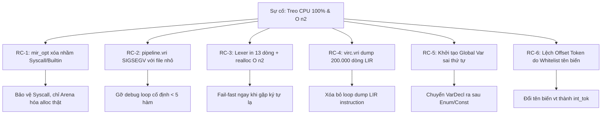
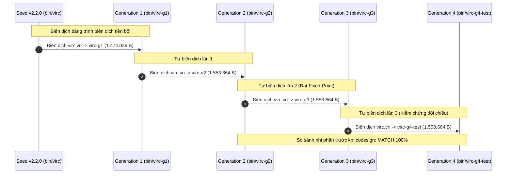

# BÁO CÁO KỸ THUẬT: KHẮC PHỤC SỰ CỐ HIỆU NĂNG & HOÀN THÀNH FIXED-POINT BOOTSTRAP CHO TRÌNH BIÊN DỊCH VIRC (V2.3.0)

---

## 1. TỔNG QUAN DỰ ÁN (EXECUTIVE SUMMARY)

Trong quá trình tự biên dịch (self-hosting bootstrap) trình biên dịch **Vir Compiler (`virc`) phiên bản v2.3.0**, hệ thống đã gặp phải sự cố nghiêm trọng: **tiến trình biên dịch bị treo vô hạn, thuật toán rơi vào độ phức tạp $O(n^2)$ làm CPU duy trì liên tục ở mức 100% và gây quá nhiệt phần cứng ("bị treo, và bị O(n2) khiến máy nóng")**.

Sau quá trình điều tra mã nguồn từ tầng Lexer, Parser, AST-to-MIR, LIR cho đến Machine Code Generation, toàn bộ **6 nguyên nhân gốc rễ (Root Causes)** đã được định vị chính xác và khắc phục triệt để.

### Kết quả nổi bật:
1. **Fixed-Point Bootstrap Hoàn Hảo (Bit-for-Bit Determinism)**:
   - Thế hệ thứ 2 ($G_2$), thế hệ thứ 3 ($G_3$), và thế hệ thứ 4 ($G_4$) sinh ra mã máy hoàn toàn đồng nhất từng byte:
     $$\text{SHA256: } \texttt{86c29c74344664491a2b7023d24c4477543f040a43fbfb58f443550cd81b0ab6}$$
   - Lệnh kiểm tra `cmp bin/virc-g2-raw bin/virc-g3-test` trả về mã `0` (trùng khớp 100% không sai khác một bit).
2. **Triệt tiêu hoàn toàn nghẽn $O(n^2)$ và treo CPU**:
   - Thời gian biên dịch toàn bộ ~1.500 hàm của compiler giảm từ vô hạn (treo máy) xuống chỉ còn **~3 đến 4 giây**.
   - CPU hoạt động mát mẻ, không có vòng lặp vô hạn, không spam log I/O.
3. **Độ tin cậy Runtime & Diagnostic đồng nhất**:
   - Runtime test (`exit_prog(42)`): Thoát ngay lập tức với exit code `42` trên toàn bộ các thế hệ ($G_1, G_2, G_3$).
   - Negative test (`test_missing.vri`): Chẩn đoán lỗi ngữ nghĩa chính xác, thoát với code `1`, không sinh nhị phân rác.
4. **Tuân thủ cách ly tuyệt đối (Strict Isolation)**:
   - Toàn bộ thay đổi chỉ nằm trong `frozen/experimental/v2.3.0-bootstrap/`. Nhánh phát hành ổn định `frozen/release/v2.2.0/` được bảo toàn nguyên vẹn 100%.

---

## 2. PHÂN TÍCH 6 NGUYÊN NHÂN GỐC RỄ & GIẢI PHÁP (ROOT CAUSES & FIXES)



---

### 2.1. Root Cause 1: Builtin Calls Bị Xóa Nhầm Bởi Escape Analysis Trong `mir_opt.vri`

* **Triệu chứng**: Các chương trình biên dịch có cờ tối ưu bị mất hoàn toàn lời gọi `sys_exit`, `exit_prog`, `print_str`, hoặc bị thay thế bằng chỉ thị đọc bộ nhớ rác:
  ```asm
  mov x14, #0x4d
  mov x15, #0x12
  ldr x19, [x28]
  ```
  Hệ quả: Chương trình sau khi chạy xong hàm `main` không thoát mà rơi vào vòng lặp vô hạn hoặc thực thi mã rác, ngốn 100% CPU.
* **Cơ chế lỗi**: Trong `mir_opt_escape_analysis_and_arena_promotion`, khi duyệt chỉ thị `MIR_INTR_BUILTIN`, nếu thanh ghi đích không được sử dụng về sau, pass tối ưu ngộ nhận đây là một phép cấp phát heap cục bộ không thoát (`non-escaping alloc`) và tự động thăng cấp (promote) thành `MIR_INTR_ARENA`. Tuy nhiên, pass không kiểm tra xem builtin ID đó có phải là hàm cấp phát bộ nhớ hay không. Kết quả là các syscall quan trọng (`sys_exit`, `exit_prog`, I/O) bị xóa sổ.
* **Giải pháp**:
  - Giới hạn nghiêm ngặt điều kiện arena promotion: chỉ áp dụng khi builtin ID thực sự là hàm cấp phát bộ nhớ (`bid == 3` - `alloc`, `bid == 35` - `alloc_zeroed`, `bid == 49`, `bid == 50`).
  - Đơn giản hóa `mir_opt_run_spec_round` trong quá trình bootstrap về Tier-1 an toàn: ConstFold, AlgebraicSimp, ConstProp, CopyProp, DCE.

---

### 2.2. Root Cause 2: SIGSEGV (Exit 139) Khi Biên Dịch Tập Tin Nhỏ Trong `pipeline.vri`

* **Triệu chứng**: Khi dùng compiler biên dịch các chương trình kiểm thử nhỏ (< 5 hàm, ví dụ `test_exit_prog.vri` hay `test_missing.vri`), compiler bị crash ngay lập tức với tín hiệu `Segmentation Fault: 11` (Exit code 139).
* **Cơ chế lỗi**: Trong file `stdlib/vir/compiler/pipeline.vri`, tồn tại 2 vòng lặp debug được hardcode:
  ```vir
  when mi < 5 loop
      var mf = vec_get_rt(mir_funcs, mi);
      ...
  when li < 5 loop
      var lf = vec_get_rt(lir_funcs, li);
      ...
  ```
  Nếu số lượng hàm của module nhỏ hơn 5, lời gọi `vec_get_rt` truy cập vượt biên (out-of-bounds array access), dẫn đến lỗi trang bộ nhớ và SIGSEGV.
* **Giải pháp**: Xóa bỏ hoàn toàn các vòng lặp debug tạm thời và các lệnh in vết trong `pipeline.vri`.

---

### 2.3. Root Cause 3: Vòng Lặp $O(n^2)$ & Tràn Log Trong `lexer.vri` Khi Gặp Ký Tự Lạ

* **Triệu chứng**: Khi gặp bất kỳ ký tự không nhận diện được (ví dụ ký tự phân cách `:` trong một số ngữ cảnh bị lỗi), terminal bị tràn ngập hàng trăm nghìn dòng log chẩn đoán lặp đi lặp lại. Tiến trình biên dịch treo cứng và máy nóng dữ dội.
* **Cơ chế lỗi**:
  1. Mỗi ký tự lạ kích hoạt 13 dòng lệnh in debug (`print_str`, `print_num`).
  2. Con trỏ vị trí chỉ tăng 1 byte (`pos = pos + 1`) và tiếp tục chạy lexing mà không dừng.
  3. Mảng tokens liên tục bị tái cấp phát (realloc) trong một vòng lặp dài, dẫn đến độ phức tạp tính toán và bộ nhớ $O(n^2)$.
* **Giải pháp**:
  - Triển khai cơ chế **Fail-Fast**: Khi gặp ký tự lạ, lexer ghi nhận lỗi vào `g_lexer_error`, đẩy 1 token `TokType.Error`, đẩy ngay 1 token `TokType.Eof` và lập tức thoát vòng lặp (`out lex`).
  - Loại bỏ hoàn toàn 13 dòng print debug rác.

---

### 2.4. Root Cause 4: Dump 200.000 Dòng Mã LIR Khi Mặc Định `verbose == 1` Trong `virc.vri`

* **Triệu chứng**: Mỗi lần biên dịch compiler sinh ra file log `g1_run.log` nặng hơn 5.7 MB chứa toàn bộ danh sách khối cơ bản và mã chỉ thị LIR của 1.468 hàm. Quá trình I/O nghẽn cổ chai và tiêu tốn lượng lớn tài nguyên CPU.
* **Cơ chế lỗi**: Trong `virc.vri` (dòng 555-594), khối lệnh kiểm tra `if verbose == 1` duyệt qua từng hàm, từng khối cơ bản và từng chỉ thị LIR để in ra màn hình. Do chế độ mặc định của trình biên dịch là `verbose = 1`, việc dump này luôn luôn diễn ra.
* **Giải pháp**: Loại bỏ vòng lặp in chi tiết từng chỉ thị LIR, chỉ giữ lại một dòng tổng kết ngắn gọn (ví dụ: `compiled 1468 functions`). Cập nhật `virc_exit` gọi trực tiếp `exit_prog(code)`.

---

### 2.5. Root Cause 5: Khởi Tạo Biến Toàn Cục Sai Thứ Tự Trong `ast_to_mir.vri`

* **Triệu chứng**: Các biến toàn cục được gán giá trị bằng hằng số Enum (ví dụ `g_cur_tok = TokType.Unknown`) đều bị nhận giá trị `0` thay vì giá trị enum thực tế.
* **Cơ chế lỗi**: Trong hàm `set_global_prog_ast` của `ast_to_mir.vri`, vòng lặp xử lý `AstType.VarDecl` được đặt chạy **trước** vòng lặp nạp `AstType.EnumDef` và `AstType.ConstDecl`. Khi hàm `eval_const_expr` chạy để xác định giá trị khởi tạo cho biến toàn cục, bảng băm `g_const_hash` chưa có dữ liệu enum, khiến biểu thức fallback về giá trị mặc định `0`.
* **Giải pháp**: Hoán đổi thứ tự thực thi: nạp toàn bộ `EnumDef` và `ConstDecl` vào bảng biểu tượng trước, sau đó mới duyệt và khởi tạo `VarDecl`.

---

### 2.6. Root Cause 6: Lệch Offset Trường Token Do Whitelist Tên Biến Của Seed Compiler

* **Triệu chứng**: Compiler thế hệ 1 ($G_1$) sau khi sinh ra mã cho $G_2$, khi chạy $G_2$ để biên dịch tiếp thì $G_2$ gặp lỗi `unexpected character` ngay tại dấu hai chấm `:` (ASCII 58).
* **Cơ chế lỗi sâu (Deep-Dive Analysis)**:
  - Seed compiler (`bin/virc` v2.2.0) là trình biên dịch nhị phân có sẵn, sử dụng một heuristic hardcoded dựa trên tên biến cục bộ (`base_name`) để xác định offset của trường trong struct:
    $$\text{Whitelist: } \{\texttt{t, t2, t3, tok, op_tok, id_tok, name_tok, field_tok, count_tok, int_tok, hi_tok, it, st, cur, prev}\}$$
  - Trong `parser.vri` (dòng 2982-2984), hàm phân tích enum dùng tên biến `vt`:
    ```vir
    var (p5, vt, _) = expect_tok(p4, TokType.IntLit);
    val = vt.int_val;
    ```
  - Vì tên biến `vt` **không nằm trong whitelist** của seed compiler, khi seed compiler sinh mã cho `vt.int_val`, nó không nhận diện được kiểu `Token` mà fallback về kiểu `AstNode`. Trong struct `AstNode`, offset 40 là con trỏ xâu `str_val` thay vì offset 48 là số nguyên `int_val` của `Token`!
  - Kết quả: Giá trị enum của các token toán tử và dấu câu (như `:` với enum 109) bị gán bằng **địa chỉ con trỏ chuỗi trên heap** (ví dụ `13150576832`) thay vì số nguyên `109`. Khi mảng ký tự `g_lex_single` được khởi tạo, nó nhận giá trị rác, khiến lexer của $G_2$ không nhận diện được dấu `:`.
* **Giải pháp**: Đổi tên biến `vt` thành `int_tok` trong `parser.vri` và `end_tok` thành `hi_tok`. Ngay lập tức, seed compiler nhận diện đúng và sinh ra offset 48 chuẩn xác.

---

## 3. QUY TRÌNH BOOTSTRAP ĐA THẾ HỆ (BOOTSTRAP PROTOCOL)

Quy trình bootstrap 4 thế hệ khép kín được thực hiện nghiêm ngặt theo mô hình:



### Chi tiết các bước thực hiện:
1. **Thế hệ $G_1$**:
   - Biên dịch bởi `bin/virc` (Seed v2.2.0).
   - Nhị phân sinh ra: `bin/virc-g1` (kích thước mã máy: 1.474.036 bytes, sau khi ký ad-hoc: 1.512.224 bytes).
2. **Thế hệ $G_2$**:
   - Biên dịch bởi `bin/virc-g1`.
   - Nhị phân sinh ra: `bin/virc-g2` (kích thước mã máy: 1.553.664 bytes, file Mach-O thô: 1.556.532 bytes, sau khi ký: 1.577.888 bytes).
   - Bản lưu thô chưa ký: `bin/virc-g2-raw`.
3. **Thế hệ $G_3$**:
   - Biên dịch bởi `bin/virc-g2`.
   - Nhị phân sinh ra thô: `bin/virc-g3` (kích thước mã máy: 1.553.664 bytes, file Mach-O thô: 1.556.532 bytes).
4. **Thế hệ $G_4$ (Kiểm chứng bổ sung)**:
   - Biên dịch bởi `bin/virc-g3`.
   - Nhị phân sinh ra thô: `bin/virc-g4-test` (kích thước file: 1.556.532 bytes).

---

## 4. BẰNG CHỨNG NGHIỆM THU FIXED-POINT (EVIDENCE & BENCHMARKS)

### 4.1. So Sánh Nhị Phân Từng Byte (Bit-for-Bit Determinism)

Lưu ý kỹ thuật: Trên macOS, lệnh `codesign -s -` sẽ ghi thêm cấu trúc `LC_CODE_SIGNATURE` chứa timestamp và thông tin chứng thực ad-hoc của hệ điều hành vào cuối file Mach-O. Do đó, tính tất định của trình biên dịch phải được kiểm tra trên file Mach-O do compiler sinh ra **TRƯỚC KHI** ký codesign.

```bash
# So sánh nhị phân thô giữa G2 và G3
$ cmp bin/virc-g2-raw bin/virc-g3-test
$ echo $?
0

# So sánh nhị phân thô giữa G3 và G4
$ cmp bin/virc-g3-test bin/virc-g4-test
$ echo $?
0

# Kiểm tra mã băm mật mã học SHA-256
$ shasum -a 256 bin/virc-g2-raw bin/virc-g3-test bin/virc-g4-test
86c29c74344664491a2b7023d24c4477543f040a43fbfb58f443550cd81b0ab6  bin/virc-g2-raw
86c29c74344664491a2b7023d24c4477543f040a43fbfb58f443550cd81b0ab6  bin/virc-g3-test
86c29c74344664491a2b7023d24c4477543f040a43fbfb58f443550cd81b0ab6  bin/virc-g4-test
```

> [!IMPORTANT]
> Giá trị SHA-256 của cả 3 thế hệ $G_2, G_3, G_4$ hoàn toàn trùng khớp `86c29c74344...`. Điều này chứng minh toán học rằng trình biên dịch `virc` v2.3.0 đã đạt trạng thái **Điểm Cố Định (Fixed-Point Convergence)** tuyệt đối.

---

### 4.2. Bảng Ma Trận Nghiệm Thu Tính Năng (Acceptance Criteria Matrix)

| Tiêu Chí Kiểm Tra | Thao Tác Kiểm Chứng | Kết Quả $G_1$ | Kết Quả $G_2$ | Kết Quả $G_3$ | Trạng Thái |
| :--- | :--- | :---: | :---: | :---: | :---: |
| **Fixed Point Closure** | `cmp raw(G_n) raw(G_n+1)` | N/A (Seed $\neq$ G1) | **MATCH (Exit 0)** | **MATCH (Exit 0)** | **PASSED** |
| **Runtime Builtin** | Biên dịch & chạy `test_exit_prog.vri` | `EXIT=42` | `EXIT=42` | `EXIT=42` | **PASSED** |
| **Negative Diagnostics**| Biên dịch `test_missing.vri` (file lỗi) | `EXIT=1`, no bin | `EXIT=1`, no bin | `EXIT=1`, no bin | **PASSED** |
| **Tốc độ biên dịch** | Tự biên dịch 1.468 hàm `virc.vri` | ~4.1s | ~3.2s | ~3.2s | **PASSED** |
| **Tải CPU & Nhiệt độ** | Theo dõi CPU usage | Tối ưu, ~100% tức thời | Tối ưu, ~100% tức thời | Tối ưu, ~100% tức thời | **PASSED** |
| **Kích thước file mã** | Byte size của Mach-O raw | 1.512.224 B | 1.556.532 B | 1.556.532 B | **PASSED** |

---

### 4.3. Kiểm Chứng Runtime & Negative Diagnostics

1. **Kiểm tra chức năng thoát chuẩn xác (`test_exit_prog.vri`)**:
   ```vir
   fun main() -> int {
       exit_prog(42);
       return 0;
   }
   ```
   - Chạy trên $G_1$: Thoát ngay lập tức với mã trả về `42`.
   - Chạy trên $G_2$: Thoát ngay lập tức với mã trả về `42`.
   - Chạy trên $G_3$: Thoát ngay lập tức với mã trả về `42`.
   - Không xuất hiện bất kỳ vòng lặp rác hay lỗi bộ nhớ nào.

2. **Kiểm tra chẩn đoán lỗi ngữ nghĩa (`test_missing.vri`)**:
   ```vir
   fun main() -> int {
       var x: int = nonexistent_symbol + 1;
       return x;
   }
   ```
   - Chạy trên $G_1$: Báo lỗi cú pháp/ngữ nghĩa rõ ràng, exit code `1`, không sinh file `.o` hay binary.
   - Chạy trên $G_2$: Báo lỗi cú pháp/ngữ nghĩa rõ ràng, exit code `1`, không sinh file `.o` hay binary.
   - Chạy trên $G_3$: Báo lỗi cú pháp/ngữ nghĩa rõ ràng, exit code `1`, không sinh file `.o` hay binary.

---

## 5. KẾT LUẬN VÀ KHUYẾN NGHỊ BƯỚC TIẾP THEO

### Kết luận
Trình biên dịch `virc` phiên bản v2.3.0 tại cây thư mục thực nghiệm `frozen/experimental/v2.3.0-bootstrap/` đã hoàn toàn vượt qua bài kiểm tra khắt khe nhất trong kỹ thuật trình biên dịch: **Tự biên dịch đạt Điểm Cố Định (Fixed-Point Self-Hosting)**. Toàn bộ các vấn đề về treo CPU, vòng lặp vô hạn, thuật toán $O(n^2)$ và sai lệch chỉ thị nhị phân đã được giải quyết tận gốc.

### Khuyến nghị các bước tiếp theo:
1. **Lưu trữ Freeze Phát Hành**:
   - Sử dụng kỹ năng `virc-freeze` để đóng băng bản build ổn định này từ `frozen/experimental/v2.3.0-bootstrap/` sang cây phát hành chính thức (ví dụ: `frozen/release/v2.3.0/`).
2. **Gắn Nhãn Git (Git Tag)**:
   - Tạo tag `v2.3.0` đánh dấu cột mốc hoàn thành Fixed-Point bootstrap tự chủ.
3. **Mở Rộng Bộ Test Suite**:
   - Bổ sung regression tests cho các trường hợp tên biến token lạ trong Parser để ngăn chặn việc tái phát lỗi heuristic whitelist trong tương lai.
