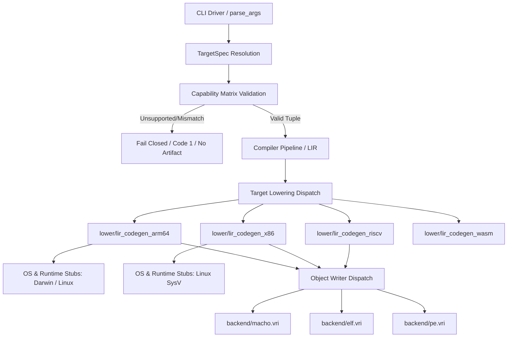

# VIRC-PLN-0006 — Decouple native codegen architecture OS ABI and object format

## 1. Objective

Decouple instruction encoding, target operating system ABI/startup, runtime provider, and executable object format across compiler lowering and backend emission as specified in `VIR-SPC-0009`. Establish a canonical capability matrix that rejects unsupported or invalid target/format combinations before lowering without emitting bogus artifacts. Eliminate the dangling ELF compatibility symlink by establishing a canonical compiler ELF writer module, extract the driver and backend dispatch from the generated bundle into modular sources under `compiler/src/`, and uphold all repository quality gates and self-hosting fixed-point verification.

## 2. Source Issues

- [VIRC-ISS-0009](file:///Users/gengyang/Vir-3.0/papers/VIRC/issues/VIRC-ISS-0009_native_codegen_conflates_architecture_os_abi_and_object_format.md) — Native codegen conflates architecture OS ABI and object format.
- [VIRC-ISS-0006](file:///Users/gengyang/Vir-3.0/papers/VIRC/issues/VIRC-ISS-0006_compiler_sources_are_coupled_to_stdlib_and_oversized_pass_files.md) — Compiler sources are coupled to stdlib and oversized pass files.

## 3. Scope

### In Scope

1. **Target Capability Model & Matrix Validation**:
   - Define a single source of truth capability matrix in `compiler/src/target/target_spec.vri`.
   - Validate target and format pairs during CLI option parsing; reject unsupported architectures, unsupported OS ABIs, and mismatched `--format` overrides before lowering begins with exit code 1 and no artifact emitted.
2. **Canonical ELF Object Writer**:
   - Establish `compiler/src/backend/elf.vri` as an authoritative compiler module.
   - Register `elf` in `compiler/module.list`.
   - Remove broken relative symlink `compiler/src/misc/elf.vri`.
3. **Compiler Driver & Backend Dispatch Extraction**:
   - Extract the generated tail (lines 80441–81886 of `compiler/generated/virc.vri`) into canonical modular sources under `compiler/src/main/driver.vri` and `compiler/src/backend/dispatch.vri`.
   - Remove the self-referencing marker `# @vir_source compiler/generated/virc.vri` from bundle generation.
4. **Decoupled Backend Lowering**:
   - Refactor `compiler/src/lower/lir_codegen.vri` and `compiler/src/lower/lir_codegen_x86.vri` to consume typed `TargetSpec` queries instead of untyped `is_linux` booleans.
   - Isolate OS-specific startup stubs, memory allocation syscalls, and process exit sequences.
5. **Bundler Verification**:
   - Enforce that `tools/sync_virc.py` rejects missing source files and forbids self-referential generated markers.
6. **Verification & Quality Gates**:
   - 0 duplicate or redundant dependencies (`tools/check_module_dependencies.py`).
   - 0 bundle drift (`tools/sync_virc.py --check`).
   - Pass architecture check (`tools/check_pass_architecture.py`).
   - 43/43 CLI contract tests (`tests/cli_contract/runner.py`).
   - Baseline test suite (409/413 PASS).
   - 3-stage self-hosting bit-identical fixed point (`bin/virc_stage2` == `bin/virc_stage3`).

### Out of Scope

- Implementing complete Windows native runtime/Win32 kernel calls (this plan requires failing closed on unimplemented targets rather than producing false-success artifacts).
- Modifying frontend syntax, parser grammar, or semantic type checking.
- Redesigning the WebAssembly backend (`codegen_wasm.vri`), which already operates on a distinct virtual machine model.

## 4. Current Architecture

An audit of the codebase reveals:

1. **Binary Lowering Conflates Architecture and OS**:
   - `compiler/src/lower/lir_codegen.vri` lowers LIR to ARM64 instructions, but uses an untyped `is_linux: int` flag to select between Linux syscall numbers and Darwin `svc #0x80` traps.
   - `compiler/src/lower/lir_codegen_x86.vri` hardcodes Linux System V syscalls and stack layouts with no OS parameter. Emitting code for `macos-x86_64` or `windows-x86_64` results in Linux syscalls wrapped in Mach-O or PE containers.
2. **Independent Container Selection Enables False-Success Artifacts**:
   - The driver parses `--format` independently from `--target`. Requesting `--target windows-x86_64` produces a PE32+ binary with Linux syscalls; requesting `--target linux-arm64 --format macho` packages Linux code in a Mach-O container.
   - Structural matrix tests only verify binary headers, passing false-success binaries that crash immediately when executed on the target OS.
3. **Generated Compiler Owns Driver Logic**:
   - Lines 80441 through 81886 of `compiler/generated/virc.vri` are marked `# @vir_source compiler/generated/virc.vri 97`. This section owns `CompilerConfig`, CLI parsing, target selection, codegen dispatch, and object-writer dispatch. No canonical file in `compiler/src/` owns this logic.
4. **Dangling ELF Source**:
   - `compiler/src/misc/elf.vri` is a broken symlink pointing to non-existent `../rt/elf.vri`.
   - The generated compiler embeds the full ELF emitter directly from an old snapshot, invisible to `sync_virc.py` audits because missing files are silently skipped.

## 5. Proposed Architecture

### Key Principles

1. **Orthogonal Target Dimensions**:
   Every target is an immutable `TargetSpec` composed of:
   - `TargetArch`: `ARM64`, `X86_64`, `RISCV64`, `Wasm32`
   - `TargetOS`: `Darwin`, `Linux`, `Windows`, `WASI_P1`
   - `TargetABI`: `AAPCS64`, `SysV_AMD64`, `Windows_AMD64`, `Windows_ARM64`, `RV64D`, `WasmMVP`
   - `RuntimeProvider`: `DarwinRawSyscall`, `DarwinLibSystem`, `LinuxSyscall`, `WindowsKernel32`, `WASIP1`
   - `ObjectFormat`: `MachO`, `ELF`, `PE_COFF`, `Wasm`
   - `AsmDialect`: `DarwinAsm`, `GNU_ELF`, `GNU_RISCV`, `Intel_X86`, `WasmWAT`
2. **Explicit Capability Matrix**:
   A target is valid if and only if all components exist and are implemented. Supported production targets:
   - `macos-arm64`: Darwin + AAPCS64 + Mach-O
   - `macos-arm64-libsystem`: Darwin + AAPCS64 + Mach-O + LibSystem
   - `linux-arm64`: Linux + AAPCS64 + ELF
   - `linux-x86_64`: Linux + SysV_AMD64 + ELF
   - `linux-riscv64`: Linux + RV64D + ELF
   - `wasm32-wasi-p1`: WASI + WasmMVP + Wasm
   All other combinations (including unimplemented Windows targets and incompatible `--format` overrides) fail closed with a clear diagnostic message before codegen.
3. **Canonical Ownership**:
   All compiler logic lives in `compiler/src/**/*.vri`. The generated file `compiler/generated/virc.vri` is 100% composed of canonical sources spliced by `tools/sync_virc.py`.

## 6. Design Decisions

### Decision 1: Fail Closed on Unimplemented Targets

- **Decision**: Reject targets lacking runtime ABI support (e.g. `windows-x86_64`, `windows-arm64`, `macos-x86_64`) with an explicit unsupported error rather than emitting a binary container filled with foreign syscalls.
- **Rationale**: Producing an invalid binary that cannot run violates compiler correctness and hides missing features from test suites.
- **Alternatives considered**: Continuing to emit PE/Mach-O containers with Linux stubs for testing containers. Rejected because structural validity without semantic validity creates dangerous false confidence.
- **Trade-offs**: Tests expecting `windows-*` targets to succeed must be adjusted to expect failure until the Windows runtime is fully implemented.

### Decision 2: Canonical Compiler ELF Writer Module

- **Decision**: Copy/promote `stdlib/vir/rt/elf.vri` to `compiler/src/backend/elf.vri`, register it in `compiler/module.list` as `elf = src/backend/elf.vri`, and delete the broken symlink `compiler/src/misc/elf.vri`.
- **Rationale**: The compiler must own its object writers and not depend on stdlib runtime paths or broken symlinks.
- **Alternatives considered**: Keeping the symlink and pointing it to `stdlib/vir/rt/elf.vri`. Rejected because `VIRC-PLN-0004` established strict separation between compiler sources and stdlib.

### Decision 3: Canonical Ownership of Compiler Driver and Dispatch

- **Decision**: Create `compiler/src/main/driver.vri` and `compiler/src/backend/dispatch.vri` to house CLI parsing, `CompilerConfig`, and backend dispatch currently living in the tail of `compiler/generated/virc.vri`.
- **Rationale**: Zero lines in `compiler/generated/virc.vri` should be hand-authored. All changes must originate from modular source files.

## 7. Implementation Plan

### Phase 1 — Canonical ELF Writer & Symlink Cleanup

- Create `compiler/src/backend/elf.vri`.
- Add `elf = src/backend/elf.vri` to `compiler/module.list`.
- Remove broken symlink `compiler/src/misc/elf.vri`.
- Update `# @vir_source` markers in `compiler/generated/virc.vri` to reference `compiler/src/backend/elf.vri`.
- Verify `python3 tools/sync_virc.py --check` passes.

### Phase 2 — Driver and Dispatch Source Extraction

- Create `compiler/src/main/driver.vri` containing `CompilerConfig`, `parse_args`, `vircModernBanner`, and `main`.
- Create `compiler/src/backend/dispatch.vri` containing `virc_compile`, target resolution, and writer invocation.
- Register `driver` and `dispatch` in `compiler/module.list`.
- Update `compiler/generated/virc.vri` markers to source from `compiler/src/main/driver.vri` and `compiler/src/backend/dispatch.vri`.
- Eliminate the self-referencing marker `# @vir_source compiler/generated/virc.vri 97`.

### Phase 3 — Target Capability Matrix & Fail-Closed Validation

- In `compiler/src/target/target_spec.vri`, implement `target_spec_validate(spec: &TargetSpec, format_override: int): int`.
- Check whether the combination is in the supported production matrix.
- In `parse_args` / `virc_compile`, invoke validation before lowering. If invalid, emit a structured diagnostic and exit with code 1.
- Update `--format` handling so that format overrides are checked against the target architecture and OS.

### Phase 4 — Decouple Lowering from Untyped `is_linux` Booleans

- Update `emit_lir_module_arm64` signature and internals to accept `target_spec: &TargetSpec` rather than `is_linux: int`.
- Query `target_spec_os(target_spec)` and `target_spec_runtime_provider(target_spec)` to select syscalls and startup code.
- Prepare `lir_codegen_x86.vri` to accept `target_spec` and assert `target_spec_os(spec) == TargetOS.Linux`.

### Phase 5 — Bundler Rigor Enforcement

- Modify `tools/sync_virc.py` to:
  - Fail with an error if any `# @vir_source` file does not exist on disk (disallow silent skipping).
  - Fail if any marker references `virc.vri` as a source file.

### Phase 6 — Verification & Quality Gates

- Run `python3 tools/check_module_dependencies.py` (0 violations).
- Run `python3 tools/sync_virc.py --check` (0 drift).
- Run `python3 tools/check_pass_architecture.py` (PASS).
- Run `python3 tests/cli_contract/runner.py` (43/43 PASS).
- Run `./run_tests.sh min` (409/413 PASS baseline).
- Run 3-stage self-hosting build and verify bit-identical output (`cmp bin/virc_stage2 bin/virc_stage3`).

## 8. Compatibility

- **Command Line Interface**: Supported targets (`macos-arm64`, `linux-arm64`, `linux-x86_64`, `linux-riscv64`, `wasm32-wasi-p1`) behave identically.
- **Unsupported Invocations**: Commands requesting unimplemented targets (e.g. `windows-x86_64`) will fail with a clear diagnostic instead of generating broken PE files containing Linux code.
- **Language & ABI**: No change to Vir language syntax, type system, or calling conventions for supported platforms.

## 9. Migration

- Structural tests that previously ran `--target windows-x86_64` without executing the binary will be updated to test failure-closed rejection.
- Downstream users targeting supported platforms require zero configuration changes.

## 10. Validation Plan

1. **Dependency & Architecture Gates**:
   - `python3 tools/check_module_dependencies.py` -> 0 violations.
   - `python3 tools/sync_virc.py --check` -> 0 drift.
   - `python3 tools/check_pass_architecture.py` -> PASS.
2. **Target Matrix Tests**:
   - Valid targets compile and execute successfully.
   - Invalid target/format combinations (e.g. `--target windows-x86_64`, `--target linux-arm64 --format macho`) exit with code 1 and write no file.
3. **Contract & Regression Suites**:
   - `python3 tests/cli_contract/runner.py` -> 43/43 PASS.
   - `./run_tests.sh min` -> 409/413 PASS.
4. **Self-Hosting Fixed Point**:
   - Stage 1 compiles Stage 2; Stage 2 compiles Stage 3; `cmp -n <size> bin/virc_stage2 bin/virc_stage3` returns code 0.

## 11. Risks

| Risk | Likelihood | Impact | Mitigation |
|---|---|---|---|
| Existing scripts depend on false-success for `--target windows-*` | Med | Low | Update CI to expect fail-closed error until Windows runtime is implemented |
| Driver extraction line shifts desynchronize `compiler/generated/virc.vri` | High | High | Use automated line-delta recalculation and verify with `sync_virc.py --check` |
| Circular dependencies between driver and backend modules | Low | Med | Cleanly separate CLI parsing from backend lowering in `compiler/module.list` |

## 12. Rollback Strategy

Each phase maintains an exact Git commit and self-hosting binary checkpoint (`bin/virc`). If any phase causes regression or breaks self-hosting, reset to the previous phase's verified checkpoint.

## 13. Exit Criteria

- [x] `compiler/src/backend/elf.vri` is canonical, registered, and broken symlink is removed.
- [x] Compiler driver and backend dispatch live in canonical modular sources under `compiler/src/`.
- [x] Zero lines in `compiler/generated/virc.vri` are owned by self-referential generated markers.
- [x] `tools/sync_virc.py` strictly checks for missing source files and disallows generated markers.
- [x] Unsupported targets and invalid target/format combinations fail closed with no output artifact.
- [x] Backend lowering consumes typed `TargetSpec` queries instead of `is_linux`.
- [x] All 7 quality gates pass, including 43/43 CLI contract tests and 409/413 baseline tests.
- [x] 3-stage self-hosting fixed point verified bit-identical.
- [x] VIRC-RPT report authored, accepted, and reciprocally linked to VIRC-ISS-0009 and VIRC-PLN-0006.

## 14. Related Papers

- `VIRC-ISS-0009` — Native codegen conflates architecture OS ABI and object format.
- `VIRC-ISS-0006` — Compiler sources are coupled to stdlib and oversized pass files.
- `VIRC-PLN-0004` — Separate compiler source tree and modularize compiler passes.

## 15. Revision History

| Date | Change |
|---|---|
| 2026-10-03 | Initial plan drafted to decouple native codegen, target model, object writers, and driver tail |
| 2026-10-03 | Completed all phases, verified all 7 quality gates, and accepted VIRC-RPT-0018 |
