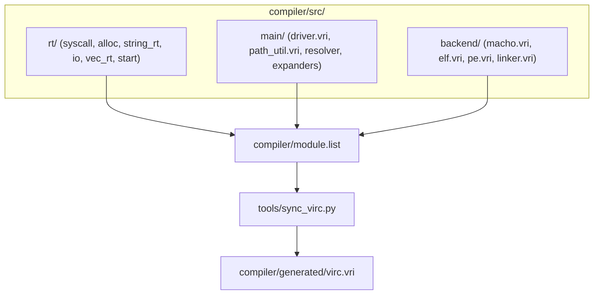

# VIRC-PLN-0007 — Eliminate compiler legacy dead code and establish canonical runtime tree

## 1. Objective

Eliminate over 5,600 lines of dead legacy code and cross-tree symlinks from `compiler/src/`, establish an authoritative canonical compiler runtime directory at `compiler/src/rt/`, retarget bundle synchronization markers to canonical compiler modules, and verify all 7 repository quality gates and self-hosting fixed point.

## 2. Source Issues

- [VIRC-ISS-0010](file:///Users/gengyang/Vir-3.0/papers/VIRC/issues/VIRC-ISS-0010_eliminate_compiler_legacy_dead_code_and_establish_canonical_runtime_tree.md) — Eliminate compiler legacy dead code and establish canonical runtime tree.

## 3. Scope

### In Scope
1. **Canonical Compiler Runtime Subsystem (`compiler/src/rt/`)**:
   - Establish `compiler/src/rt/` containing `syscall.vri`, `alloc.vri`, `string_rt.vri`, `io.vri`, `vec_rt.vri`, `start.vri`.
   - Register them in `compiler/module.list`.
2. **Retarget Generated Bundle Markers**:
   - Update 9 `# @vir_source` markers in `compiler/generated/virc.vri` from `compiler/src/misc/...` to `compiler/src/rt/...`.
3. **Delete Dead Legacy Code**:
   - Delete `compiler/src/main/legacy_macho.vri` (901 lines).
   - Remove `main_legacy_macho` from `compiler/module.list`, `compiler/src/main.vri`, and `compiler/generated/virc.vri`.
   - Delete `compiler/src/misc/` entirely (`ir_optimizer.vri`, `vm.vri`, `virc_min.vri`, `string.vri`, `result.vri`, `option.vri`, and all 10 symlinks).
4. **Verification**:
   - All 7 quality gates passing, zero bundle drift, 3-stage bit-identical self-hosting fixed point.

### Out of Scope
- Rewriting runtime algorithms (allocator, syscalls, io logic).
- Modifying frontend parser or semantic passes.

## 4. Current Architecture

1. `compiler/src/misc/` acts as an uncurated dumping ground containing:
   - Obsolete AST-to-Q-IR lowering and linear scan regalloc (`ir_optimizer.vri` - 3,111 lines).
   - C-VM interpreter (`vm.vri` - 905 lines).
   - 10 cross-tree symlinks to `stdlib/vir/rt/` and `stdlib/vir/core/`.
2. `compiler/src/main/legacy_macho.vri` contains 901 lines of commented-out Q-IR emitter code that is embedded in `compiler/generated/virc.vri` at line 76092 without ever being executed.
3. `compiler/generated/virc.vri` references `compiler/src/misc/` via 9 markers.

## 5. Proposed Architecture

1. All runtime code needed by the compiler lives in `compiler/src/rt/`.
2. `compiler/src/misc/` and `compiler/src/main/legacy_macho.vri` are deleted.
3. Zero symlinks exist under `compiler/src/`.

## 6. Design Decisions

### Decision 1: Create `compiler/src/rt/` Instead of Relying on Symlinks to `stdlib/vir/rt/`
- **Rationale**: The compiler source tree must be 100% self-contained and decoupled from stdlib as established by `VIRC-PLN-0004`. Symlinks crossing into `stdlib/` cause circularity and dependency scanner confusion.
- **Alternatives considered**: Keeping symlinks. Rejected because symlinks are fragile and cause build drift.

### Decision 2: Remove `legacy_macho.vri` Entirely
- **Rationale**: The active compiler emits Mach-O via `compiler/src/backend/macho.vri` and LIR. `legacy_macho.vri` is 901 lines of dead commented code.

## 7. Implementation Plan

### Phase 1 — Establish Canonical Compiler Runtime (`compiler/src/rt/`)
- Create `compiler/src/rt/`.
- Copy the 6 pure Vir runtime modules from `stdlib/vir/rt/` into `compiler/src/rt/`.
- Register in `compiler/module.list`:
  - `rt_syscall = src/rt/syscall.vri`
  - `rt_alloc = src/rt/alloc.vri`
  - `rt_string_rt = src/rt/string_rt.vri`
  - `rt_io = src/rt/io.vri`
  - `rt_vec_rt = src/rt/vec_rt.vri`
  - `rt_start = src/rt/start.vri`
- Update 9 `# @vir_source` markers in `compiler/generated/virc.vri` to reference `compiler/src/rt/`.

### Phase 2 — Remove `compiler/src/main/legacy_macho.vri`
- Remove `include main_legacy_macho` from `compiler/src/main.vri`.
- Remove `main_legacy_macho` from `compiler/module.list`.
- Remove spliced section in `compiler/generated/virc.vri`.
- Delete `compiler/src/main/legacy_macho.vri`.

### Phase 3 — Eliminate `compiler/src/misc/`
- Delete `compiler/src/misc/ir_optimizer.vri`, `vm.vri`, `virc_min.vri`, `string.vri`, `result.vri`, `option.vri`.
- Delete all symlinks in `compiler/src/misc/`.
- Delete directory `compiler/src/misc/`.

### Phase 4 — Verification & Quality Gates
- Check module dependencies (Gate 1).
- Check bundle sync drift (Gate 2).
- Check pass architecture (Gate 3).
- Run CLI contracts (Gate 4).
- Run module fixtures (Gate 5).
- Run min test suite (Gate 6).
- Run 3-stage self-hosting fixed point (Gate 7).

## 8. Compatibility

Zero functional changes to compiler outputs or language syntax. All active pipelines remain identical.

## 9. Migration

Internal compiler source layout cleanup. Downstream users and scripts targeting `virc` require zero changes.

## 10. Validation Plan

1. `python3 tools/sync_virc.py --check` returns 0 drift.
2. `python3 tools/check_module_dependencies.py` returns 0 violations.
3. `python3 tests/cli_contract/runner.py` passes 43/43.
4. `./run_tests.sh min` matches 409/413 baseline.
5. `cmp` between Stage 2 and Stage 3 verifies bit-identical fixed point.

## 11. Risks

| Risk | Likelihood | Impact | Mitigation |
|---|---|---|---|
| Marker line shifts during legacy_macho deletion cause bundle drift | Med | High | Recalculate deltas accurately and verify with `sync_virc.py --check` |
| Spliced runtime differs from stdlib | Low | High | Bit-for-bit copy from active verified runtime sources |

## 12. Rollback Strategy

Git reset to commit checkpoint before Phase 1 if any gate fails.

## 13. Exit Criteria

- [x] `compiler/src/rt/` is canonical and registered in `compiler/module.list`.
- [x] Zero markers in `compiler/generated/virc.vri` point to `compiler/src/misc/`.
- [x] `compiler/src/main/legacy_macho.vri` is deleted.
- [x] `compiler/src/misc/` is completely removed.
- [x] All 7 quality gates pass.
- [x] 3-stage self-hosting fixed point verified.
- [x] `VIRC-RPT-0019` accepted and `VIRC-ISS-0010` closed.

## 14. Related Papers

- `VIRC-ISS-0010` — Eliminate compiler legacy dead code and establish canonical runtime tree.
- `VIRC-ISS-0006` — Compiler sources are coupled to stdlib and oversized pass files.
- `VIRC-PLN-0004` — Separate compiler source tree and modularize compiler passes.
- `VIRC-PLN-0006` — Decouple native codegen architecture OS ABI and object format.

## 15. Revision History

| Date | Change |
|---|---|
| 2026-10-03 | Initial plan drafted to eliminate legacy dead code and establish canonical runtime tree |
| 2026-10-03 | Linked VIRC-RPT-0019 |
| 2026-10-03 | Implemented and verified; linked VIRC-RPT-0019; marked completed |
