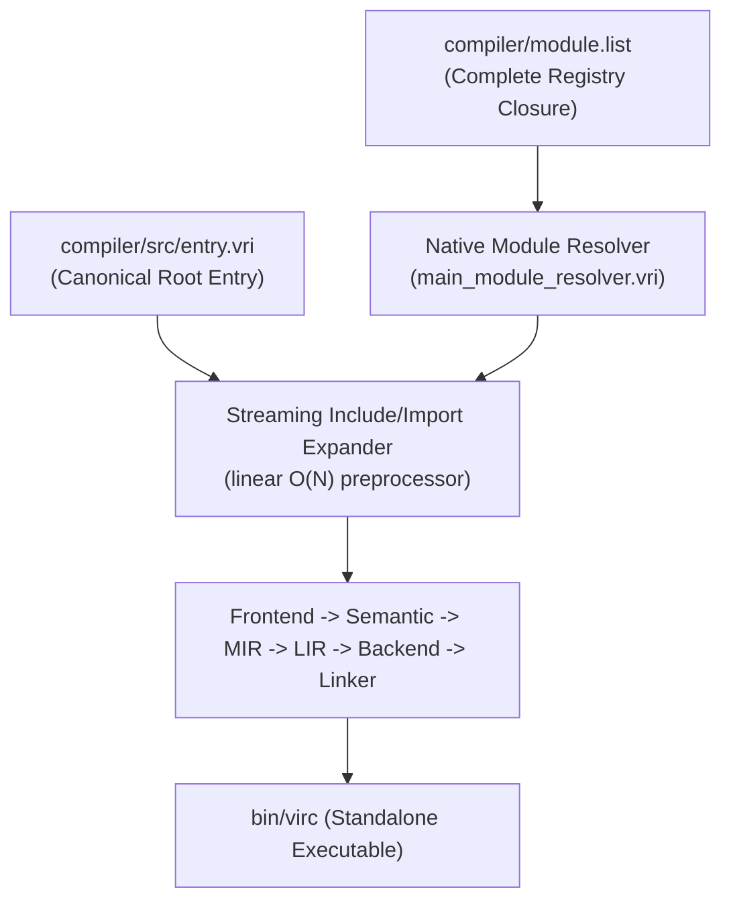

# VIRC-PLN-0017 — Native compiler project ingestion and dependency closure without python bundle synchronization

## 1. Objective

Provide a canonical native self-host build path where the native `virc` compiler can build itself directly from the compiler source tree (`compiler/src/**`) and module registry (`compiler/module.list`), without invoking Python (`tools/sync_virc.py`) and without requiring the pre-expanded generated bundle (`compiler/generated/virc.vri`) as an input discovery manifest.

## 2. Source Issues

- [VIRC-ISS-0032](file:///Users/gengyang/Vir-3.0/papers/VIRC/issues/VIRC-ISS-0032_self_hosted_virc_cannot_build_from_compiler_module_registry_without_python_bundl.md): Self-hosted virc cannot build from compiler module registry without Python bundle synchronization.

## 3. Scope

### In Scope

1. **Registry Closure & Module Resolution (`compiler/module.list`, `compiler/src/main/module_resolver.vri`):**
   - Eliminate hidden and unresolved module dependencies (such as `mir_types`, `mir_ops`, `mir_builder`, `rt.*`, and `compiler.*`).
   - Add directory aliases `rt = src/rt` and `compiler = src` to `compiler/module.list` to support standard namespace forms.
   - Enforce fail-closed resolution for any missing module or registry mapping.

2. **Canonical Project Root Entry (`compiler/src/entry.vri`):**
   - Define a complete, self-contained dependency root in `compiler/src/entry.vri` that includes runtime initialization, frontend, IR/lowering, backend code generation, linker, and driver entry point.
   - Guarantee that compiling `compiler/src/entry.vri` directly produces a functional compiler executable with entry point `main`.

3. **Decoupling from Python Synchronizer (`tools/sync_virc.py`):**
   - Demote `tools/sync_virc.py` from the required build path.
   - Enable `virc` to natively expand and ingest the complete compiler module graph from `entry.vri` using the linear streaming preprocessor implemented in `VIRC-PLN-0016`.

4. **Multi-Stage Bootstrap Fixed Point:**
   - Execute a 3-stage bootstrap building directly from `compiler/src/entry.vri`: Stage 1 -> Stage 2 -> Stage 3.
   - Verify bitwise binary reproducibility (`cmp bin/virc_stage2 bin/virc_stage3` == 0).

5. **Validation and Regression Gates:**
   - Add negative tests for missing module mappings, missing files, duplicate keys, and dependency cycles.
   - Add positive tests ensuring `module_graph.py` and native `virc` both resolve the complete compiler closure cleanly.

### Out of Scope

- Changing the Vir language specification syntax or module semantics (§14/§29).
- Modifying standard library public APIs outside `compiler/` and `tools/`.
- Removing the distribution convenience bundle `compiler/generated/virc.vri` entirely if downstream packaging still references it (instead, ensure it can be generated or validated directly from canonical sources).

## 4. Current Architecture

Currently, the compiler source code is modularized into 316 files under `compiler/src/`. However:
1. `compiler/src/entry.vri` is an incomplete stub with only 19 lines and no dependency directives or entry function.
2. `tools/sync_virc.py` parses existing `# @vir_source` markers inside `compiler/generated/virc.vri` and copies file slices into place. The generated bundle itself acts as the implicit topological manifest.
3. Compiling `compiler/src/main/driver.vri` fails because submodules contain unresolved dependencies such as `mir_types` which are not registered in `compiler/module.list`.
4. `module_graph.py --entry driver` fails with `[E2120] Module 'mir_types' could not be resolved`.

## 5. Proposed Architecture

1. **Registry Single Source of Truth:** `compiler/module.list` maps all canonical module names and directory aliases (`rt`, `compiler`, `virc`).
2. **Canonical Root Entry:** `compiler/src/entry.vri` declares the complete top-level dependency order across runtime, diagnostics, frontend, mid-level IR, code generation, and driver main entry.
3. **Pure Native Build:** Running `./bin/virc compiler/src/entry.vri -o bin/virc` natively resolves all dependencies, traverses the complete DAG, expands modules in linear streaming time, and links the compiler binary without Python.

## 6. Design Decisions

### Decision 1: Resolving `mir_types`, `mir_ops`, and `mir_builder`

- **Decision:** Map `mir_types`, `mir_ops`, and `mir_builder` to `src/ir/mir/mir.vri` in `compiler/module.list`.
- **Rationale:** `compiler/src/ir/mir/mir.vri` already defines and exports `MirType`, `MirOp`, `MirOperand`, `MirInstr`, `MirPhi`, `MirBlock`, `MirFunc`, and the builder constructors. Registering these aliases preserves existing submodule include directives without breaking backward compatibility.
- **Alternatives considered:** Renaming all 13 occurrences in `compiler/src/ir/mir/opt/*.vri` to `include mir`. While also feasible, registering the canonical aliases in `module.list` guarantees both existing and future modular includes resolve cleanly.

### Decision 2: Adding Directory Aliases `rt` and `compiler`

- **Decision:** Add `rt = src/rt` and `compiler = src` to `compiler/module.list`.
- **Rationale:** Submodules use standard dotted paths like `import ... from rt.string_rt`, `include rt.io`, and `import ... from compiler.context`. Directory aliases allow the native resolver to map dotted paths hierarchically (`rt.io` -> `src/rt/io.vri`) without cluttering the registry with hundreds of individual aliases.

### Decision 3: Ordering in `compiler/src/entry.vri`

- **Decision:** Order inclusions in `compiler/src/entry.vri` to respect declaration-before-use dependencies across the compiler subsystems:
  1. Runtime base (`rt_syscall`, `types_prelude`, `rt_alloc`, `rt_string_rt`, `rt_io`, `rt_vec_rt`, `rt_start`).
  2. Backend object formats (`backend_macho`, `backend_elf`, `backend_pe`, `ffi_imports`).
  3. CLI, diagnostics, and tooling (`cli_environment`, `cli_ui`, `cli_storage`, `tool_json`, `diagnostic_store`, `error_codes`).
  4. Frontend (`lexer`, `parser_ast`, `parser`, `source_manager`).
  5. Intermediate Representation & Lowering (`mir`, `mir_cfg`, `mir_ssa`, `mir_opt`, `lir`, `ast_to_mir`, `lir_codegen`).
  6. Backend Codegen & Linker (`target`, `codegen`, `linker`, `binary`).
  7. Driver & Entry Point (`driver_config`, `driver_pipeline`, `driver_args`, `driver_main_entry`).

## 7. Implementation Plan

### Phase 1 — Registry Closure & Namespace Aliases
- Files: `compiler/module.list`
- Changes:
  - Add `rt = src/rt`
  - Add `compiler = src`
  - Add `mir_types = src/ir/mir/mir.vri`
  - Add `mir_ops = src/ir/mir/mir.vri`
  - Add `mir_builder = src/ir/mir/mir.vri`
- Expected result: `python3 tools/module_graph.py` resolves all dependencies without error.

### Phase 2 — Compiler Root Entry Composition
- Files: `compiler/src/entry.vri`
- Changes:
  - Populate `entry.vri` with the complete structured subsystem inclusion graph.
  - Verify `python3 tools/module_graph.py --root . --entry bundle_entry` traverses the entire compiler DAG.

### Phase 3 — Native Compilation from Entry Source
- Files: `compiler/src/entry.vri`, `compiler/src/main/driver.vri`
- Changes:
  - Build `bin/virc_stage1` directly via `./bin/virc compiler/src/entry.vri -o bin/virc_stage1`.
  - Fix any symbol visibility or ordering conflicts discovered during native project build.

### Phase 4 — Multi-Stage Bootstrap & Fixed-Point Verification
- Execute:
  - Stage 1: `./bin/virc compiler/src/entry.vri -o bin/virc_stage1`
  - Stage 2: `./bin/virc_stage1 compiler/src/entry.vri -o bin/virc_stage2`
  - Stage 3: `./bin/virc_stage2 compiler/src/entry.vri -o bin/virc_stage3`
  - Verify `cmp bin/virc_stage2 bin/virc_stage3 == 0`.

### Phase 5 — CI Gate & Regression Suite
- Add negative tests for missing module mappings and cycles.
- Update `tools/check_module_dependencies.py` to validate full registry closure.
- Document verification results in `VIRC-RPT-0033`.

## 8. Compatibility

- **Source compatibility:** 100% compatible. No language syntax or stdlib APIs are modified.
- **CLI compatibility:** `./bin/virc compiler/src/entry.vri -o bin/virc` becomes the primary self-host build command.
- **Generated bundle compatibility:** `compiler/generated/virc.vri` can be regenerated directly from `entry.vri` using `virc`'s native expander, removing the dependency on `tools/sync_virc.py`.

## 9. Migration

1. Update self-hosting instructions and build scripts to invoke `./bin/virc compiler/src/entry.vri -o bin/virc`.
2. Keep `tools/sync_virc.py --check` in continuous integration to verify that `compiler/generated/virc.vri` stays in sync with `compiler/src/**` during transition.
3. Once all external tooling switches to `compiler/src/entry.vri`, deprecate `tools/sync_virc.py` without breaking existing workflows.

## 10. Validation Plan

1. `python3 tools/module_graph.py --root . --entry bundle_entry` must resolve all modules with 0 errors.
2. Direct native build `./bin/virc compiler/src/entry.vri -o bin/virc_test` must succeed.
3. 3-stage bootstrap `cmp bin/virc_stage2 bin/virc_stage3` must return 0.
4. Test suite `python3 tests/perf_contract/test_include_scaling.py` and `python3 tests/cli_contract/runner.py` must pass.
5. VPS validation `./paper validate` must report 0 errors.

## 11. Risks

| Risk | Likelihood | Impact | Mitigation |
|---|---|---|---|
| Ingestion order causes circular dependency | Medium | High | Structure `entry.vri` according to strict layer hierarchy (runtime -> frontend -> IR -> backend -> driver). |
| Symbol name collision in flat scope | Low | Medium | Submodules have already been partitioned and verified in Phase 10 modularization. |
| Alternate CWD causes resolution failure | Low | High | `module_resolver.vri` uses `find_file_up` to anchor relative to project root regardless of CWD. |

## 12. Rollback Strategy

1. If modular ingestion fails in a specific target environment, fall back to compiling `compiler/generated/virc.vri` directly using `./bin/virc compiler/generated/virc.vri -o bin/virc`.
2. Existing Git history preserves `compiler/generated/virc.vri` and `tools/sync_virc.py` intact.
3. The previous bootstrap binary `bin/virc_bootstrap` remains available as an emergency bootstrap fallback.

## 13. Exit Criteria

- Native `virc` compiles `compiler/src/entry.vri` directly with 0 errors without calling Python.
- 3-stage bootstrap fixed point achieved (`cmp bin/virc_stage2 bin/virc_stage3 == 0`).
- `tools/sync_virc.py` is no longer required to build or maintain the compiler.
- Report `VIRC-RPT-0033` accepted and `VIRC-ISS-0032` marked `RESOLVED`.

## 14. Related Papers

- [VIRC-ISS-0032](file:///Users/gengyang/Vir-3.0/papers/VIRC/issues/VIRC-ISS-0032_self_hosted_virc_cannot_build_from_compiler_module_registry_without_python_bundl.md)
- [VIRC-RPT-0033](file:///Users/gengyang/Vir-3.0/papers/VIRC/reports/VIRC-RPT-0033_native_compiler_project_ingestion_and_dependency_closure_report.md)

## 15. Revision History

| Date | Change |
|---|---|
| 2026-10-04 | Initial plan created to resolve VIRC-ISS-0032 native compiler project ingestion |
| 2026-10-04 | Added Migration and Rollback Strategy; linked VIRC-RPT-0033; marked COMPLETED |
